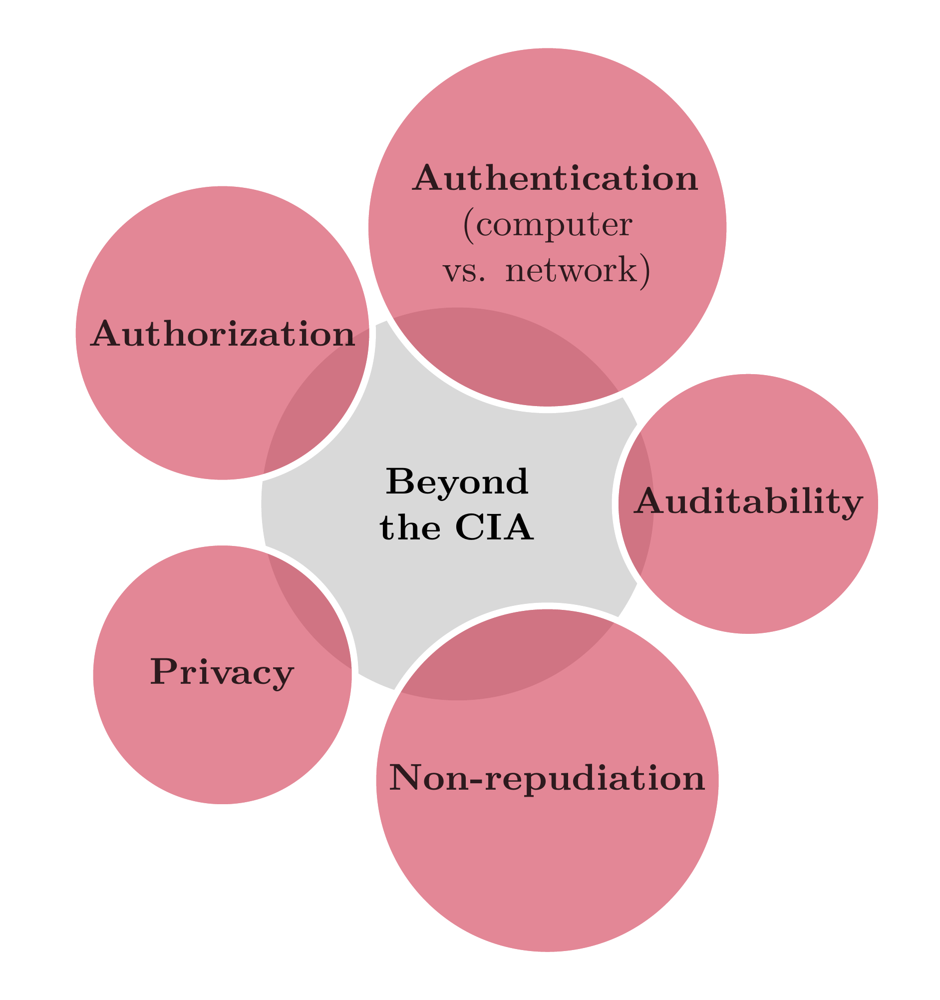

```{r setup, include=FALSE}
knitr::opts_chunk$set(cache = FALSE,
                      echo = TRUE,
                      warning = FALSE,
                      message = FALSE,
                      progress = FALSE, 
                      verbose = FALSE,
                      dev = 'png',
                      fig.height = 3,
                      dpi = 300,
                      fig.align = 'center')

options(htmltools.dir.version = FALSE)


miamired = '#C3142D'

if(require(pacman)==FALSE) install.packages("pacman")
if(require(devtools)==FALSE) install.packages("devtools")
if(require(countdown)==FALSE) devtools::install_github("gadenbuie/countdown")
if(require(xaringanExtra)==FALSE) devtools::install_github("gadenbuie/xaringanExtra")
if(require(urbnmapr)==FALSE) devtools::install_github('UrbanInstitute/urbnmapr')
if(require(emo)==FALSE) devtools::install_github("hadley/emo")

knitr::knit_engines$set(python = reticulate::eng_python)
```

```{r xaringan-themer, include=FALSE, warning=FALSE}
if(require(xaringanthemer) == FALSE) install.packages("xaringanthemer")
library(xaringanthemer)

style_mono_accent(base_color = "#84d6d3",
                  base_font_size = "20px")

xaringanExtra::use_xaringan_extra(c("tile_view", "tachyons", "panelset", "search", "fit_screen", "editable", "clipboard"))

xaringanExtra::use_extra_styles(
  hover_code_line = TRUE,
  mute_unhighlighted_code = TRUE
)
```


## Learning Objectives for Today's Class

- Define **information security (Infosec)**, its **main goals**, and how it fits within a firm’s overall security protocols  

- Describe the **three main steps** in information security: prevention, detection, and response.

- Explain why **prevention as a sole security measure is deemed to fail**. 

- Describe **course structure**, **goals**, and **overview**.  

---
class: inverse, center, middle

# Information Security & its Main Goals

---

## What is Security?

.pull-left[

.large[**Some Working Definitions**]

- According to the [Merriam-Webster Dictionary](https://www.merriam-webster.com/dictionary/security), **security** can be defined as: **"the
quality or state of being secure: such as freedom from danger."**  

- I.e., the objective is to **protect against adversaries who would do harm whether it is intentional or not.**  

- For example, **national security** is a ``multilayered system that protects the sovereignty of
a state, its assets, its resources, and its people.'' ([Whitman and Mattford, 2022, p. 8](https://www.cengage.com/c/principles-of-information-security-7e-whitman-mattord/9780357506431/))
]


.pull-right[

.large[**Security in Modern Organizations**]

```{r run_latex_file1, echo=FALSE, cache=TRUE, results='hide'}
tinytex::xelatex('../../figures/firm_security.tex')
Sys.sleep(2)
pdftools::pdf_convert('../../figures/firm_security.pdf', dpi = 600,
                      filenames = '../../figures/firm_security.png')
Sys.sleep(2)
```


```{r read_firm_sec_chart, echo=FALSE, out.width='80%', fig.alt="An illustrative bubble diagram highlighting the different dimensions of a firm's security. At the center is the largest bubble, labeled 'Firm's Security Dimensions' in bold text. Surrounding this central bubble are four smaller bubbles, each representing a key aspect of security: 'Physical', 'Personnel', 'Operations', and 'Network'. Additionally, there's a bubble for 'Information'. Each bubble is connected to the central one, indicating the interconnected nature of these security aspects. The bubbles are uniformly colored in miami red, and the text inside each bubble is small and bold for emphasis.", fig.align='center', fig.cap="Integrating InfoSec within the Broader Spectrum of Firm's Security Dimensions"}

```
]

---

## What is Cyber/Information Security?

While some researchers distinguish between them, in this course, we will use both terms
**interchangeably**. Possible **definitions for cyber/information security include:**

- .bold[According to the [Merriam-Webster Dictionary](https://www.merriam-webster.com/dictionary/cybersecurity), cyber security can be defined as: .red[“measures taken to protect a computer or computer system (as on the Internet) against unauthorized access or attack.”]]  

- .bold[According to the [SANS Institute](https://www.sans.org/information-security/), “information security refers to the processes and methodologies which are designed and implemented to protect print, electronic, or any other form of confidential, private and sensitive information or data from .red[unauthorized access, use, misuse, disclosure, destruction, modification, or disruption.]"]


---

## Information Security Goals

.pull-left[

.large[**The CIA Triad:**]

- .bold[.red[Confidentiality:] Preventing unauthorized reading/disclosure of information.]  

- .bold[.red[Integrity:] Preventing unauthorized modification of information.]  

- .bold[.red[Availability:] Preventing unauthorized withholding of information/ resources]

]


.pull-right[
```{r run_latex_file2, echo=FALSE, cache=TRUE, results='hide'}
tinytex::xelatex('../../figures/cia_triad.tex')
Sys.sleep(2)
pdftools::pdf_convert('../../figures/cia_triad.pdf', dpi = 600,
                      filenames = '../../figures/cia_traid.png')
Sys.sleep(2)
```


```{r read_cia_chart, echo=FALSE, out.width='80%', fig.alt="A visually striking cybersecurity diagram featuring a central node labeled 'CIA' in bold white text on a miamired background, symbolizing the core principles of cybersecurity: Confidentiality, Integrity, and Availability. The central node is connected to three surrounding nodes, each with miamired borders and no fill color. The 'Confidentiality' node includes a lock icon, 'Integrity' features a check circle icon, and 'Availability' is represented with a cloud icon. All arrows linking the central node to the surrounding nodes are in miamired, emphasizing the interconnectedness of these principles.", fig.align='center', fig.cap="The Interconnected Core of Cybersecurity: CIA Principles in Focus."}

```

]


---

## Class Activity: Explaining the CIA Triad

`r countdown(minutes = 7, seconds = 0, top = 0, font_size = "2em")`

.panelset[

.panel[.panel-name[Activity]

Suppose that I would like to start an online banking business, named Miami University Online Bank (MUOB). Assume that we have:


<div style="text-align: center; display: flex; justify-content: center;">
  <div style="flex: 1; margin: 0 10px;">
    
    <p style="text-align: center;">Fadel (Owner)</p>
  </div>
  
  <div style="flex: 1; margin: 0 10px;">
    
    <p style="text-align: center;">John McClane (Client)</p>
  </div>
  
  <div style="flex: 1; margin: 0 10px;">
    
    <p style="text-align: center;">Hans Gruber (Bad Guy)</p>
  </div>
</div>

**Your task:** "Think-Pair-Share activity" Reflect individually, then discuss with your partner to finalize your explanation of the CIA principles in the MUOB context. Write it down in 2nd panel.
]

.panel[.panel-name[Your Solution] 

.can-edit.key-activity1[
- **Confidentiality:** Edit me in your web browser.  

- **Integrity:** Edit me.  

- **Availability:** Edit me.

] 
]
]


???

In the context of Miami University Online Bank (MUOB), the CIA principles - Confidentiality, Integrity, and Availability - can be explained with the help of the roles of Fadel (Owner), John (Customer), and Hans (Bad Guy):

- **Confidentiality:** This principle ensures that sensitive information is accessible only to those authorized to view it. For MUOB, confidentiality means that customer data, such as John's account details and transaction history, should only be accessible to John and authorized MUOB personnel like Fadel. It prevents unauthorized individuals like Hans from accessing or viewing this sensitive information. Techniques to ensure confidentiality include strong authentication mechanisms, encryption, and access control measures.  

- **Integrity:** Integrity refers to maintaining the accuracy and consistency of data over its entire lifecycle. For MUOB, this means ensuring that any transaction or data modification, like deposits or withdrawals made by John, is accurately recorded and unaltered. Fadel, as the owner, is responsible for implementing systems that log and verify every transaction to prevent Hans from unauthorized altering of transaction data or account balances. Tools like checksums, digital signatures, and audit trails help maintain integrity.  

- **Availability:** This principle ensures that information and resources are available to authorized users when needed. In MUOB's context, availability means that John should be able to access his account and perform transactions whenever he needs to, without interruptions. Fadel needs to ensure that the online banking system is robust, with minimal downtime, and is protected against attacks from Hans that could disrupt service, such as Denial of Service (DoS) attacks. Measures like redundant systems, regular maintenance, and strong cybersecurity defenses are vital to ensure high availability.


---

## Beyond the CIA: Other InfoSec Objectives

```{r run_latex_file3, echo=FALSE, cache=TRUE, results='hide'}
tinytex::xelatex('../../figures/beyond_cia.tex')
Sys.sleep(2)
pdftools::pdf_convert('../../figures/beyond_cia.pdf', dpi = 600,
                      filenames = '../../figures/beyond_cia.png')
Sys.sleep(2)
```


```{r read_beyond_cia_chart, echo=FALSE, out.width='48%', fig.alt="Bubble diagram depicting key cybersecurity concepts beyond the traditional CIA Triad. Central bubble labeled 'Beyond the CIA' is surrounded by five other bubbles representing Authentication (distinguishing computer vs. network security), Authorization, Privacy, Non-repudiation, and Auditability.", fig.align='center'}

```


???
This diagram suggests additional key concepts that are crucial in the broader scope of cybersecurity:

- **Authentication (Computer vs. Network):** This refers to the process of verifying the identity of a user or a device. It's a critical security measure to ensure that only authorized users or devices can access certain information or networks. The distinction between computer and network authentication highlights the different approaches and mechanisms required for securing individual devices (like a computer) and network access.

- **Authorization:** This concept involves granting or denying rights and permissions to access and use information or resources. After a user is authenticated, authorization determines what they are allowed to do within the system, like accessing specific files, executing commands, or reading data.

- **Privacy:** This involves protecting sensitive personal information from unauthorized access and disclosure. In the context of cybersecurity, it emphasizes the need to handle and secure personal and private data, respecting user confidentiality and regulatory requirements.

- **Non-repudiation:** This principle ensures that a party in a communication cannot deny the authenticity of their signature on a document or a message that they originated. In cybersecurity, it's crucial for maintaining the integrity of transactions and communications, often implemented through digital signatures and audit trails.

- **Auditability:** This refers to the ability to audit and review logs and records to trace and understand actions taken within a system. Effective auditability helps in detecting security violations, understanding the impact of the incidents, and improving the security posture of an organization.

By including these concepts, the chart emphasizes that a comprehensive approach to cybersecurity involves more than just the traditional CIA Triad; it also requires attention to authentication, authorization, privacy, non-repudiation, and auditability.

---

## Risk Management Controls

Effective cybersecurity **begins** with implementing diverse risk management controls, each targeting specific security aspects:

- **Administrative:** Includes the development and deployment of policies and procedures; for example:  
    * Password policies  
    * Principal of least privilege (POLP)  
    
- **Physical:** In addition to securing a firm’s premises through doors/locks/etc., typical risk
management controls utilize the:  
    * Principal of separation of duties

???
See [IBM's 5 Principles for Cyber Architecture](https://www.youtube.com/watch?v=jq_LZ1RFPfU&ab_channel=IBMTechnology) for more details.


---

## Protocols, Host-Based Protections, and Other Key Preventive Measures

- **Protocols:** For example, the reliance on secure socket layer (SSL) to authenticate the web source  

- **Host-based protections:** secure operating systems and/or patching  

- **Access Control:** Through identification (username), authentication (over a computer/ network), and authorization (file permissions, need-to-know principle)  

- **Firewalls:** to control inter-network traffic (e.g., from/to internet)  

- **Security by design:** code reviews, unit testing, defense in depth, and principle of least privilege  

---

## Class Activity: Have you been Pwned?

`r countdown(minutes = 2, seconds = 0, top = 0, font_size = "2em")`

- The purpose of this class activity is to investigate how many of your web accounts have been breached. This activity consists of the following steps:  

- Go to <https://haveibeenpwned.com/>  

- Insert the email you use most online (e.g., in my case it is my Gmail) into the search bar and then click on "pwned?"  

- Record the count of breaches that you were pwned in.  

- Anonymously, report the count of your breaches on the survey site <www.menti.com> (you will need to include the access code shown in class).  

- **Outside of class:** .bold[Address the breaches by changing your password for these sites, opting into 2-factor authentication, and changing the passwords in other websites] (if you re-used this password).


---

## Class Activity: Have you been Pwned? (Cont.)

<div style='position: relative; padding-bottom: 56.25%; padding-top: 35px; height: 0; overflow: hidden;'><iframe sandbox='allow-scripts allow-same-origin allow-presentation' allowfullscreen='true' allowtransparency='true' frameborder='0' height='315' src='https://www.mentimeter.com/app/presentation/al36fmihoqbkfy3uusd9hx6r9i1sc7o6/embed' style='position: absolute; top: 0; left: 0; width: 100%; height: 100%;' width='420'></iframe></div>


---

class: inverse, center, middle

# Prevention as a Sole Security Measure is Deemed to Fail

---

## Failure of Prevention: World’s Biggest Data Breaches

```{r biggestet_breaches, echo=FALSE}
knitr::include_url('https://informationisbeautiful.net/visualizations/worlds-biggest-data-breaches-hacks/',
                   height = "500px")
```

---

## Failure of Prevention: World's Most Targeted Industries

<center>
<a href="https://www.statista.com/statistics/1315805/cyber-attacks-top-industries-worldwide/" rel="nofollow"></a>
</center>

---

## Failure of Prevention: Monetary Damage in the U.S.

<center>
<a href="https://www.statista.com/statistics/267132/total-damage-caused-by-by-cybercrime-in-the-us/" rel="nofollow"></a>
</center>


---

## Failure of Prevention: Attacks Constantly Getting Easier

```{r attack-soph, echo=FALSE, out.width='66%', fig.cap='Attack sophistication versus intruder technical knowledge', fig.alt='The figure shows how the attack sophistication has increased over time, while the intruder’s technical knowledge has decreased. This means more amateur attackers can apply sophisticated attacking tools to conduct dangerous attacks against computational devices, networks or smart premises.' }
knitr::include_graphics(path = '../../figures/attack-soph.png')
```

.footnote[
<html>
<hr>
</html>

**Source:** Ramirez, J. H. P. (2017). An Anomaly Behavior Analysis Methodology for the Internet of Things: Design, Analysis, and Evaluation ([Doctoral dissertation, The University of Arizona](https://arizona.aws.openrepository.com/handle/10150/625581)).
]

---

## Failure of Prevention: Attacks Constantly Getting Faster

```{r attack-faster, echo=FALSE, out.width='75%', fig.cap='The timeline of cyber-threads scope of damage and impact time', fig.alt='Figure indicates that the attackers can currently impact regional networks in term of minutes, and it has been predicted that they will be able to impact the global infrastructure in the matter of seconds in the near future.' }
knitr::include_graphics(path = '../../figures/attack-time.PNG')
```

.footnote[
<html>
<hr>
</html>

**Source:** Ramirez, J. H. P. (2017). An Anomaly Behavior Analysis Methodology for the Internet of Things: Design, Analysis, and Evaluation ([Doctoral dissertation, The University of Arizona](https://arizona.aws.openrepository.com/handle/10150/625581)).
]

---

## Failure of Prevention: Attackers Having More Options

```{r attack_vectors, echo=F, out.width='55%', fig.alt="IoT devices are easy targets, presenting attackers with gaps they can exploit to deliver ransomware and malicious code and launch intrusion attacks."}
knitr::include_graphics("https://venturebeat.com/wp-content/uploads/2023/06/most-common-targets.png?w=816&strip=all", dpi = 600)
```

.footnote[
<html>
<hr>
</html>

**Source:** Louis Columbus (2023). Why attackers love to target IoT devices. [VentureBeat](https://venturebeat.com/security/why-attackers-love-to-target-iot-devices/).
]

---

## Why is Prevention .black[Not] Enough?

<html>
<ul>
    <li>Inherent weaknesses in increasingly more complex systems/networks
        <ul>
            <li>Poor Design
                <ul>
                    <li>Software and hardware</li>
                    <li>Example: sendmail (race condition vulnerability, buffer overflow, group permission vulnerability, etc.)</li>
                </ul>
            </li>
            <li>Poor Implementation
                <ul>
                    <li>Security an afterthought</li>
                    <li>Lack of personnel experience/training</li>
                    <li>Poor system configuration (e.g., default firewall configurations with open insecure ports)</li>
                </ul>
            </li>
            <li>Poor Management
                <ul>
                    <li>Inadequate policies/procedures</li>
                </ul>
            </li>
        </ul>
    </li>
</ul>

</html>


???
This slide presents a structured breakdown of the inherent weaknesses found in increasingly complex systems and networks, categorized into three main areas: Poor Design, Poor Implementation, and Poor Management. Each category is explored with further details:

- Poor Design:  
  - This point addresses fundamental flaws in the architecture of software and hardware.  
  - An example given is 'sendmail', a widely used mail transfer agent, which has had vulnerabilities like race conditions, buffer overflows, and group permission issues. These vulnerabilities are often due to design choices that do not adequately consider security.  

- Poor Implementation:   
  - Here, the focus is on how systems are set up and maintained, highlighting that security is often not the primary concern.  
  - Factors contributing to poor implementation include a lack of experienced personnel or training, and suboptimal system configurations. For instance, default firewall configurations might leave insecure ports open, creating security risks.  

- Poor Management:  
  - This final point stresses the importance of good governance in managing IT systems.  
  - Inadequate policies and procedures can lead to systemic weaknesses, as they fail to establish a strong security culture or provide clear guidelines for maintaining security.

---

## Why is Prevention .black[Not] Enough?

- Tradeoff between security and usability  

- Cost of prevention  

.footnote[
<html>
<hr>
</html>

**Source:** Adapted from CS 259D, Stanford University, <https://web.stanford.edu/class/cs259d/lectures/Session1.pdf>
]

---

class: inverse, center, middle

# The Three Main Steps in Information Security (Defense)

---

## A Taxonomy of Information Security Measures


```{python 3_steps, echo=FALSE, fig.alt="A polar diagram with three segments labeled 'Prevention', 'Detection', and 'Response' arranged in a clockwise direction. Each segment is filled with a miamired color, emphasizing their interconnected roles in Information Security. In the center of the diagram, in bold black text, reads 'The 3 Main Steps of InfoSec (Defense)', highlighting the core focus of the diagram. The background is void of any radial ticks or lines, focusing solely on the labeled segments and central title", warning=FALSE, results='hide',fig.keep='all'}
import matplotlib.pyplot as plt
import numpy as np

# Define labels
labels = ['Prevention', 'Detection', 'Response']
colors = ['#D0102E'] * 3  # miamired color

# Determine the angles for the circular diagram
angles = np.linspace(0, 2 * np.pi, len(labels), endpoint=False).tolist()
angles += angles[:1]  # complete the loop

# Create the plot
fig, ax = plt.subplots(figsize=(6, 6), subplot_kw=dict(polar=True))
ax.set_theta_offset(np.pi / 2)  # Rotate the start point
ax.set_theta_direction(-1)  # Clockwise

# Draw one axe per variable and add labels
plt.xticks(angles[:-1], labels, color='black', size=14)

# Hide radial ticks
ax.set_rticks([])  
ax.spines['polar'].set_visible(False)

# Fill area
ax.fill(angles, [1]*4, color='#C3142D', alpha=0.3)

# Adding central title with proper positioning and smaller font
ax.text(0.5, 0.5, "The 3 Main\nSteps of\nInfoSec\n(Defense)", ha='center', va='center', 
        color='black', size=14, transform=ax.transAxes)

plt.show()
```


---

class: inverse, center, middle

# Course Design, Expectations, and Overview


---

## Course Overview

Traditionally, information technology (IT) security was a job that entailed using a few tools, solutions and best practices that focused on attack prevention and protect a company’s sensitive information and network assets. However, these solutions are no longer sufficient. The businesses are transitioning to a new era, where cybersecurity is **enhanced and almost always requires data-driven analytical solutions**. The primarily goals of data-driven security are to:  
  - discover malicious patterns from the data-lakes of logs produced by security software, and   
  - develop automated tools that can assist in the surveillance of security-related data.  
  
This course covers various analytic applications in information/cyber security including: **user behavior analysis, network and host intrusion detection, web security, phishing detection, and emerging issues in Industrial Internet of Things (IIoT) security**. Note that the course is designed to be **very applied, involving a large amount of programming to examine real datasets.**

---

## Course Overview

```{r run_latex_file4, echo=FALSE, cache=TRUE, results='hide'}
tinytex::xelatex('../../figures/course_overview.tex')
Sys.sleep(2)
pdftools::pdf_convert('../../figures/course_overview.pdf', dpi = 600,
                      filenames = '../../figures/course_overview.png')
Sys.sleep(2)
```


```{r read_course_overview, echo=FALSE, out.width='60%', fig.alt="Flowchart depicting the structure of the ISA 419 course, divided into two phases. The top node is labeled 'ISA 419'. Below it, two branching nodes represent the course's phases. The left node, 'Phase I: Foundations and Leveling (Weeks 1-8)', focuses on foundational aspects. The right node, 'Phase II: Applications (Weeks 9-15)', covers application-oriented topics. Arrows flow from ISA 419 to both Phase I and Phase II, indicating the course progression.", fig.align='center', fig.cap='How the ISA 419 course is organized.'}

```

---

## Course Objectives

Upon completing the course, you will:

- Describe key cybersecurity concepts, including the CIA Triad, access management, incident response, and common cybersecurity best practices.  

- Demonstrate a fundamental understanding of the role of analytical solutions in state-of-the-art cybersecurity solutions.  

- Understand the uniqueness of cybersecurity datasets, including the nature of unbalanced data and diversity of data in each class, asymmetrical costs of misclassification, and non-stationary inference.  

- Understand the theory behind some commonly used statistical methodologies and machine learning algorithms in data-driven security.  

- Use and implement an appropriate modeling paradigm to tackle cybersecurity problems.

---

## Instructional Approach

```{r run_latex_file_5, echo=FALSE, cache=TRUE, results='hide'}
tinytex::xelatex('../../figures/instructional_approach.tex')
Sys.sleep(20)
pdftools::pdf_convert('../../figures/instructional_approach.pdf', dpi = 600,
                      filenames = '../../figures/instructional_approach.png')
Sys.sleep(20)
```


```{r read_course_approach, echo=FALSE, out.width='100%', fig.alt="An overview of the instructional approach for ISA 419.", fig.align='center', fig.cap='An overview of the instructional approach for ISA 419.'}
 
```


---

## How will I Evaluate your Learning?

```{r run_latex_file_6, echo=FALSE, cache=TRUE, results='hide'}
tinytex::xelatex('../../figures/evaluation.tex')
Sys.sleep(2)
pdftools::pdf_convert('../../figures/evaluation.pdf', dpi = 600,
                      filenames = '../../figures/evaluation.png')
Sys.sleep(2)
```


```{r read_evaluation, echo=FALSE, out.width='100%', fig.alt="An overview of the evaluation components for ISA 419.", fig.align='center', fig.cap='An overview of the evaluation components for ISA 419.'}
 
```

---

class: inverse, center, middle

# The Equifax Data Breach: A Case Study

---

## Case Background

**Equifax Overview:**
  - Major credit reporting agency.  
  - Manages sensitive personal data of millions.  

**The Breach Discovery:**  
  - Disclosed in September 2017.  
  - Compromised personal information of 147 million individuals.

**Vulnerability Exploited:**  
  - Apache Struts CVE-2017-5638.  
  - Equifax's system was unpatched.  

???
See the HBS case study under references for more details.


---

## Case Background (Cont.)

**Breach Timeline:**
  - Apache reported the vulnerability in March 2017.  
  - Equifax’s systems remained vulnerable for months.  
  - Unauthorized access occurred from May to July 2017.

**Data Compromised:**  
  - Included names, Social Security numbers, birth dates.  
  - Addresses, and in some cases, driver's license numbers and credit card numbers.


---

## The Detailed Timeline of the Equifax Data Breach

```{r equifax_timeline, include=FALSE, out.width='90%', eval=FALSE}
df = readr::read_csv('../../data/equifax_timeline.csv') |>   
  dplyr::mutate(
    date = lubridate::mdy(date),
    year = lubridate::year(date),
    month = lubridate::month(date),
    long_description = stringr::str_wrap(long_description, width = 17)
    ) |> 
  dplyr::arrange(date) |> 
  dplyr::mutate(position = c(rep(c(1, -1, 0.5, -0.5),4), 1, -1),
                position2 = c(rep(c(1.1, -1.1, 0.6, -0.6),4), 1.1, -1.1) ) |> 
  na.omit()

df |> 
  ggplot2::ggplot(ggplot2::aes(x = date, y = 0, label = `long_description`, col = grouping, group = grouping)) + 
  ggplot2::geom_point(ggplot2::aes(y=0), size=1) + 
  ggplot2::geom_hline(yintercept=0, linewidth=0.7) +
  ggplot2::theme_bw(base_size = 8) +
  ggplot2::theme(
    plot.background = ggplot2::element_rect(color = "black"),
    legend.title = ggplot2::element_text(),
    legend.position = 'bottom',
    plot.margin = ggplot2::unit(c(0.1, 0.2, 0.1, 0.1), 'cm'),
    plot.title = ggplot2::element_text(hjust = 0.5, face="bold"),
    plot.subtitle = ggtext::element_markdown(hjust = 0.5, lineheight = 1.5),
    axis.title.y= ggplot2::element_blank(),
    axis.ticks.y= ggplot2::element_blank(),
    # axis.ticks.x = ggplot2::element_blank(),
    axis.text.x= ggplot2::element_text(face = 'bold'),
    axis.title.x= ggplot2::element_text(face = 'bold'),
    axis.text.y= ggplot2::element_blank(),
    panel.grid.major = ggplot2::element_blank(),
    panel.grid.minor = ggplot2::element_blank()
  ) +
  ggplot2::geom_text(ggplot2::aes(y = position2), size = 3.5, fontface = 'bold') +
  ggplot2::geom_segment(ggplot2::aes(y = position, yend=0, xend = date)) +
  ggplot2::scale_color_brewer(palette = 'Dark2') +
  ggplot2::guides(colour = ggplot2::guide_legend(nrow = 1)) +
  ggplot2::scale_x_date(breaks = scales::pretty_breaks(n=12), limits = c(lubridate::ymd('2017-02-15'), lubridate::ymd('2018-03-15'))) +
  ggplot2::scale_y_continuous(limits = c(-1.25, 1.25)) +
  
  ggplot2::labs(
    x = '',
    caption = expression(paste(bold('Data Source:'),  ' Publicly available information on the Equifax Breach.   ', bold('Created By: '), 'Fadel M. Megahed')),
    title = 'A Representative Sample of Major Events in the Equifax Breach') -> p1

ggplot2::ggsave(filename = '../../figures/equifax_timeline.pdf', plot = p1,
                width = 8.5, height = 4)

pdftools::pdf_convert('../../figures/equifax_timeline.pdf', dpi = 600,
                      filenames = '../../figures/equifax_timeline.png')
```

```{r equifax_out, echo=FALSE, out.width='100%'}

```


---
class: inverse, center, middle

# Recap

---

## Summary of Main Points

By now, you should be able to do the following:  

- Define **information security (Infosec)**, its **main goals**, and how it fits within a firm’s overall security protocols  

- Describe the **three main steps** in information security: prevention, detection, and response.

- Explain why **prevention as a sole security measure is deemed to fail**. 

- Describe **course structure**, **goals**, and **overview**. 


---

## 📝 Review and Clarification 📝

1. **Class Notes**: Take some time to revisit your class notes for key insights and concepts.
2. **Zoom Recording**: The recording of today's class will be made available on Canvas approximately 3-4 hours after the session ends.
3. **Questions**: Please don't hesitate to ask for clarification on any topics discussed in class. It's crucial not to let questions accumulate. 


---

## 🎯 Assignment 🎯

.font80[

In pairs, you are expected to do a deep dive on the case by reading the following sources:  
  - **Student 1:** should read in detail the  [CSO Online](https://www.csoonline.com/article/567833/equifax-data-breach-faq-what-happened-who-was-affected-what-was-the-impact.html) article.  
  - **Student 2:** should read in detail the archived artile from the [EPIC report](https://archive.epic.org/privacy/data-breach/equifax/)  
  - You are **both** encouraged to explore any hyperlinks within both articles and take notes pertaining to the discussion questions below.


**Discussion Questions**

1. What was the Apache Struts CVE-2017-5638 vulnerability and its associated patch?

1. Discuss how the Equifax breach violated the principle of **confidentiality**.  

1. what was the impact of the breach on Equifax's data **integrity** and service **availability**?  

1. Evaluate Equifax's response strategy in terms of information security best practices.  


**Assignment Details and Submission**

The assignment should be submitted on [Canvas](https://miamioh.instructure.com/courses/229048/assignments/3056659). See the assignment submission page for more details.

]
