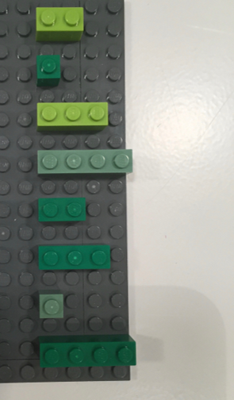

```{r setup, include=FALSE}
knitr::opts_chunk$set(echo = TRUE,
                      warning = FALSE,
                      message = FALSE,
                      cache = TRUE,
                      fig.align = "center",
                      fig.pos = 'p',
                      fig.width = 5,
                      fig.height= 2.5,
                      allowframebreaks = TRUE,
                      fig.margin=TRUE)

miamired = '#C3142D'
```

# Preface

### Learning Objectives for Today's Class
\begin{block}{\textbf{Learning Objectives}} 
  \begin{itemize}
  \item  \textbf{Understand basic syntax in both R and Python}
  \item  \textbf{Use both platforms to solve the problem from last class}
  \item  \textbf{Use either platform to generate reproducible reports through the R Markdown or Jupyter Notebook tools}
  \end{itemize}
\end{block}

\textbf{As always, please feel free to slow me down, stop me to ask questions, and/or ask me to explain questions differently. \textcolor{miamired}{My main objective today is to ensure that we all have basic programming commands of both languages.} \textcolor{gray}{If time allows throughout the semester, I would attempt to provide you with solutions to some of the problems in both programming languages.}}


### The Beauty of Programming Languages\footnotemark

- Programming languages are **languages**.

- **It's just text** -- which gives you access to **two extremely powerful techniques**!!!  

  + `Ctrl` + `C` `r fontawesome::fa("copy", fill = miamired)`  &  `Ctrl` + `V` `r fontawesome::fa("paste", fill = miamired)`

- In addition, programming languages are generally  

  + Readable (IMO way easier than trying to figure what someone did in an `r fontawesome::fa("file-excel", fill = 'green')`)  
  
  + Open (so you can `r fontawesome::fa("google", fill = miamired)` it)  
  
  + Reusable and reproducible 
  
  + Diffable (version control is extremely powerful)  


\footnotetext{
\textbf{Source:} Content in "The Beauty of Programming Languages" is from \href{https://speakerdeck.com/hadley/you-cant-do-data-science-in-a-gui?slide=14}{Hadley Wickham's You Can't Do Data Science in a GUI}}


### A Note on Both Programming Languages {.allowframebreaks}
\begin{figure}[p]

  \href{https://www.datacamp.com/community/tutorials/r-or-python-for-data-analysis}{\includegraphics[height=0.7\textheight, frame]{../../figures/python-vs-r1.png}}
  
  \caption{Comparisons Per DataCamp.com}
  
  \vspace{-\baselineskip}
\end{figure}

\begin{figure}[p]

  \href{https://www.datacamp.com/community/tutorials/r-or-python-for-data-analysis}{\includegraphics[height=0.7\textheight, frame]{../../figures/python-vs-r2.png}}
  
  \caption{Comparisons Per DataCamp.com}
  
  \vspace{-2\baselineskip}
\end{figure}

\begin{figure}[p]

  \href{https://www.datacamp.com/community/tutorials/r-or-python-for-data-analysis}{\includegraphics[height=0.7\textheight, frame]{../../figures/python-vs-r3.png}}
  
  \caption{Comparisons Per DataCamp.com}
  
  \vspace{-2\baselineskip}
\end{figure}

\begin{figure}[p]

  \href{https://www.datacamp.com/community/tutorials/r-or-python-for-data-analysis}{\includegraphics[height=0.7\textheight, frame]{../../figures/python-vs-r4.png}}
  
  \caption{Comparisons Per DataCamp.com}
  
  \vspace{-2\baselineskip}
\end{figure}

\begin{figure}[p]

  \href{https://www.datacamp.com/community/tutorials/r-or-python-for-data-analysis}{\includegraphics[height=0.7\textheight, frame]{../../figures/python-vs-r5.png}}
  
  \caption{Comparisons Per DataCamp.com}
  
  \vspace{-2\baselineskip}
\end{figure}

\begin{figure}[p]

  \href{https://www.datacamp.com/community/tutorials/r-or-python-for-data-analysis}{\includegraphics[height=0.7\textheight, frame]{../../figures/python-vs-r6.png}}
  
  \caption{Comparisons Per DataCamp.com}
  
  \vspace{-2\baselineskip}
\end{figure}


### How to Learn Any Programming Language\footnotemark

* **Get hands dirty**  

*  Documentation! Documentation! Documentation!  

* (Not surprisingly) Learn to Google: what that error message means (I `r fontawesome::fa("google")` a lot)

\footnotetext{
\textbf{Source:} Slide is based on \href{https://stats220.earo.me/01-intro.html\#7}{Kia Ora's How I Learn a Technology}}


# R Primer

## Setup

### RStudio Interface

\begin{center}
  \includegraphics[width=0.8\textwidth, height=0.8\textheight, keepaspectratio]{../../figures/rstudio-interface.png}
\end{center}

\footnotetext{
\textbf{Image credit:} Stuart Lee}


### Setting Up RStudio (Do This Once)

\begin{center}
  \includegraphics[width=0.8\textwidth, height=0.8\textheight, keepaspectratio]{../../figures/rstudio-setup.PNG}
\end{center}


### Change the Appearance of RStudio to your Taste 

\begin{center}
  \includegraphics[width=0.8\textwidth, height=0.8\textheight, keepaspectratio]{../../figures/rstudio-appearance.PNG}
\end{center}


### What is an .RProject?


* Each university course is a project, and get your work organised.  
* A self-contained project is a folder that contains all relevant files, for example my `ISA 419/` includes:
   + `ISA419.Rproj`  
   + `figures/`
   + `lectures/`  
     +  `01_intro_cyber_sec/`  
     +  `02_software_intro/` 
* All working files are **relative** to the **project root** (i.e. `isa419/`).
* The project should just work on a different computer.


## `r fontawesome::fa("r-project")` 101: Operators

### Assignment
**The first operator we have talked about in R is the assignment operators `<-`, `=`, and `->`, which can be used as follows.**

```{r assignment}
x1 <- 5

x2 = 5

5 -> x3

print(paste0("The values of x1, x2 and x3 are ", x1, ", ", x2, ", and ", x3, " respectively. As you can see from this printout that all three operators have resulted in the same performance."))
```

**Note that the operator `<-` can be written using the shortcut "Alt" +  "-" on a Windows computer.**


### Retrieval 

We can retrieve/call the object using its name as follows:
```{r ret1}
x1

x3
```


### Arthimetic 
**While we will not specifically talk about doing math in R, these operators are helpful for you. The table below is scrapped from [Quick-R: Operators (click here for more details)](https://www.statmethods.net/management/operators.html).**

```{r a_operators, echo=FALSE}
pacman::p_load(rvest, tidyverse, DT)
web <- "https://www.statmethods.net/management/operators.html"
web %>%  read_html() %>% html_nodes("table") %>%
  .[[1]] %>% html_table(header = TRUE) -> math_table

math_table %>% knitr::kable()

```

### Logical
**As with the previous slide, the table below is scrapped from [Quick-R: Operators (click here for more details)](https://www.statmethods.net/management/operators.html).**

```{r l_operators, echo=FALSE}
web %>%  read_html() %>% html_nodes("table") %>%
  .[[2]] %>% html_table(header = TRUE) -> logical_table

logical_table %>% knitr::kable()

```


## `r fontawesome::fa("r-project")` 101: Syntax, Data Types, Data Structures and Functions

###  `r fontawesome::fa("r-project")` is a Vector Language: Sample Output

Learning from a **sample 10 obs. from the Z distribution** (i.e., $x \sim \mathcal{N}(0, \, 1)$)
```{r vec_lang1}
x_vec = rnorm(n=10, mean = 0, sd = 1) # generating std normal dist data

x_vec > 0 # finding which elements in x are larger than 0

sum(x_vec > 0) # summing the number of elements (i.e., how many are > 0)
```

If we focus on the obtained outputs, we can see that **both** are vectors:  
  - `x_vec > 0` returns a vector of size 10 (TRUE/FALSE for each element)  
  - `sum(x_vec > 0)` returns a vector of size 1
  
**There are no scalars in R !!!**


### `r fontawesome::fa("r-project")` is a Vector Language: Atomic Vectors

\begin{columns}

\begin{column}{0.48\textwidth}
  \begin{itemize}
    \item Vectors come in two flavors, which differ by their elements' types:
    \item atomic vectors -- all elements must have the same type
    \item lists (dataframes are a special case)-- elements can be different
  \end{itemize}
\end{column}
\begin{column}{0.48\textwidth}
  \begin{center}
    \includegraphics[width=\textwidth, height = 0.8\textheight, keepaspectratio]{../../figures/summary-tree-atomic.png}
  \end{center}
\end{column}

\end{columns}


### Data Types: A Visual Introduction [1]

  \begin{center}
    \includegraphics[width=\textwidth, height = 0.45\textheight, keepaspectratio]{../../figures/atomic.png}
  \end{center}

- To check the **type of** an object in `r fontawesome::fa("r-project")`, you can use the function `typeof`:

```{r type_of}
typeof(x_vec)
```


### Data Types: A Visual Introduction [2]


```{r read_types_chart, echo=FALSE, out.width='100%', fig.alt="The four data types that we will utilize the most in our course.", fig.align='center', fig.cap='The four data types that we will utilize the most in our course.'}
knitr::include_graphics("../../figures/four_popular_data_types.png")
```


### Data Types: A Visual Introduction [3]\footnotemark

```{r legos_viz, fig.align='center', out.width='100%', fig.cap='A visual representation of different types of atomic vectors', fig.alt='A visual representation of different types of atomic vectors', echo=FALSE}

knitr::include_graphics('../../figures/legos-jbryan-types.png')

```

\footnotetext{The images are from the excellent \href{https://github.com/jennybc/lego-rstats\#readme}{lego-rstats GitHub Repository by Jenny Bryan}}


### Data Structures: Atomic Vector (1D)\footnotemark


```{r legos_viz2, fig.align='center', out.width='80%', fig.cap='Keeping the  visual representation of different types of atomic vectors in your head!!', fig.alt='A visual representation of different types of atomic vectors', echo=FALSE}

knitr::include_graphics('../../figures/legos-jbryan-types.png')

```

```{r atomic_departments}
dept = c('ACC', 'ECO', 'FIN', 'ISA', 'MGMT')
nfaculty = c(18L, 19L, 14L, 25L, 22L)

```


\footnotetext{The images are from the excellent \href{https://github.com/jennybc/lego-rstats\#readme}{lego-rstats GitHub Repository by Jenny Bryan}}


### Data Structures: 1D to 2D [Visually]\footnotemark

```{r legos_viz3, fig.align='center', out.width='80%', echo=FALSE}

knitr::include_graphics('../../figures/legos-jbryan-structures.png')

```


\footnotetext{The images are from the excellent \href{https://github.com/jennybc/lego-rstats\#readme}{lego-rstats GitHub Repository by Jenny Bryan}}


### Data Structures: 1D to 2D [In Code]

```{r tibbles}
library(tibble)

fsb_tbl <- tibble(
  department = dept, 
  count = nfaculty, 
  percentage = count / sum(count))
fsb_tbl
```


### Data Structures: Lists [1]\footnotemark


An object contains elements of **different data types**.

```{r legos_viz4, fig.align='center', out.width='20%', echo=FALSE}



```

\footnotetext{The images are from the excellent \href{https://github.com/jennybc/lego-rstats\#readme}{lego-rstats GitHub Repository by Jenny Bryan}}


### Data Structures: Lists [2]

```{r list_viz, fig.align='center', out.width='100%', echo=FALSE}

knitr::include_graphics('../../figures/list.png')

```

```{r list1a}
lst <- list( # list constructor/creator
  1:3, # atomic double/numeric vector  of length = 3 #<< 
  "a", # atomic character vector of length = 1 (aka scalar) #<< 
  c(TRUE, FALSE, TRUE), # atomic logical vector of length = 3 #<< 
  c(2.3, 5.9) # atomic double/numeric vector of length =3 #<< 
)
writeLines( paste0(lst, collapse = '\n') ) # printing the list
```

\footnotetext{The image is from \href{https://adv-r.hadley.nz/vectors-chap.html\#lists}{Hadley Wickham's Advanced R: Chapter 3 on Vectors}}


### Data Structures: Lists [3]

```{r list_pepper, fig.align='center', out.width='85%', echo=FALSE}

knitr::include_graphics('../../figures/pepper.png')

```

\footnotetext{The image is from \href{https://twitter.com/hadleywickham/status/643381054758363136?lang=en}{Hadley Wickham's Tweet on Indexing lists in R}}


### Data Structure: Matrices

A matrix is a \textbf{2D data structure} made of \textbf{one/homogeneous data type}.

```{r num_matrix1}
x_mat = matrix( sample(1:10, size = 4), nrow = 2, ncol = 2 ) 
str(x_mat) # its structure?
```

```{r num_matrix2, results='hold'}
x_mat # printing it nicely
print('-----------------')
x_mat[1, 2] # subsetting #<< 
```


### Data Structure: Data Frames [1]

```{r df1}
df1 <- data.frame(x = 1:3, y = letters[1:3])

typeof(df1) # showing that its a special case of a list

attributes(df1) # but also is of class data.frame
```

In contrast to a regular list, a data frame has **an additional constraint: the length of each of its vectors must be the same.** This gives data frames their **rectangular structure.**


### Data Structure: Data Frames [2]\footnotemark

As noted in the creation of `df1`, columns in a data frame can be of different types. Hence, it is more widely used in data analysis than matrices.

```{r legos_viz5, fig.align='center', out.width='30%', echo=FALSE}

knitr::include_graphics('../../figures/legos-jbryan-dataframe-w-text.png')

```

\footnotetext{The images are from the excellent \href{https://github.com/jennybc/lego-rstats\#readme}{lego-rstats GitHub Repository by Jenny Bryan}}


### Functions

A function call consists of the **function name** followed by one or more **argument** within parentheses.

```{r function-mean}
temp_high_forecast = c(37, 37, 26, 22, 37, 27, 29, 40)
mean(x = temp_high_forecast)
```

* function name: `mean()`, a built-in R function to compute mean of a vector
* argument: the first argument (LHS `x`) to specify the data (RHS `temp_high_forecast`)


### Check the function's help page with `?mean`

> Please take 2 minutes to investigate the help page for `mean` in R Studio.

```r
mean(x = temp_high_forecast, trim = 0, na.rm = FALSE, ...)
```

* Read **Usage** section
  + What arguments have default values?
* Read **Arguments** section
  + What does `trim` do?
* Run **Example** code


### Function Arguments

Match by **positions**
```{r function-args-pos}
mean(temp_high_forecast, 0.1, TRUE)
```

Match by **names**
```{r function-args-names}
mean(x = temp_high_forecast, trim = 0.1, na.rm = TRUE)
```


### Packages (i.e. Using Other People's Functions)
\textbf{An awesome (yet challenging) part of the R echo system is that there are tens of thousands of package that can be easily accessed. These packages allow you to easily access a large variety of functions that are useful for data scraping, cleaning, exploration, and modeling. While there are several ways to install and load packages in R, I will use the \href{https://cran.r-project.org/web/packages/pacman/pacman.pdf}{pacman approach} whenever possible due to its simplicity.}

\vfill

\textcolor{miamired}{\textbf{If you are not a fan of this approach, please feel free to use other approaches.}}


### Pacman
**One reason that I am a fan of the pacman approach is that it allows me to load the packages into R (and install them if they are installed, through the `p_load()`). Thus, it saves a step from the traditional `install.packages()` and then `library()` approach.**

```{r pacman}
if(require(pacman)==FALSE) install.packages("pacman")
pacman::p_load(tidyverse, magrittr, DataExplorer, skimr)
```


### Live Demo
\textbf{Now, let us explore \href{https://www.dropbox.com/s/88ajdyp7hfnvrl2/lanl-auth-dataset-1-03.csv}{the dataset from last class}.}

**For the data in lines 1.1M-1.2M, please answer the following questions:**  

- What is the timestamp of observation (i.e. row number) 1,200,000?    

- What are the number of unique users for the aforementioned 100,000 observations?   

- What is the number of unique computers used by U12 for the aforementioned 100,000 observations?  


```{r dataset, include=FALSE}
library(tidyverse)
lanl_tbl = read.csv('../../data/lanl-auth-dataset-1-03.csv',
                    header = F,
                    skip = 1099999,
                    nrows = 100000)

# What is the timestamp
lanl_tbl$V1[nrow(lanl_tbl)]

# Unique users
length( unique(lanl_tbl$V2) ) 

# Number of Computers Used by U12
lanl_tbl %>% filter(V2 == 'U12') %>% count(V3)
```


# Python Primer

### Python Primer
**For the sake of time, let us jump into Anaconda for a live demo.**  

\textbf{Now, let us explore \href{https://www.dropbox.com/s/88ajdyp7hfnvrl2/lanl-auth-dataset-1-03.csv}{the dataset from last class}.}

**For the data in lines 1.1M-1.2M, please answer the following questions:**  

- What is the timestamp of observation (i.e. row number) 1,200,000?    

- What are the number of unique users for the aforementioned 100,000 observations?   

- What is the number of unique computers used by U12 for the aforementioned 100,000 observations?  


```{python dataset_py, include=FALSE}
import pandas as pd
lanl_df = pd.read_csv('../../data/lanl-auth-dataset-1-03.csv', header = None, skiprows = 1099998, nrows = 100000)

# What is the timestamp
lanl_df.tail(1)

# Unique users
lanl_df[1].nunique()

# Number of Computers Used by U12
lanl_df[lanl_df[1] == 'U12'].nunique()

landl_cols_1_and_2 = lanl_df.iloc[:, 1:3] # Remember that Python does not slice inclusive of the ending index.
u12_dict = landl_cols_1_and_2[landl_cols_1_and_2[1] == 'U12'].value_counts().to_dict()
len(u12_dict)
```


# Recap

### Learning Objectives for Today's Class
\begin{block}{\textbf{Learning Objectives}} 
  \begin{itemize}
  \item \textbf{Understand basic syntax in both R and Python}
  \item  \textbf{Use both platforms to solve the problem from last class}
  \item  \textbf{Use either platform to generate reproducible reports through the R Markdown or Jupyter Notebook tools}
  \end{itemize}
\end{block}


### Things to Do [1]

- Go over your notes, read the references below, and complete [this self-paced R tutorial](http://rstudio.fsb.miamioh.edu:3838/megahefm/isa419/week01/). 

- To improve your `r fontawesome::fa("r-project")` skills, please read:

\begin{columns}
  \begin{column}{0.4\textwidth}
  \begin{center}
    \includegraphics[width=0.2\textwidth]{../../figures/cover_r_data_science.png}
  \end{center}
  \begin{itemize}
    \item \href{https://r4ds.had.co.nz/workflow-basics.html}{Workflow: basics}
    \item \href{https://r4ds.had.co.nz/workflow-scripts.html}{Workflow: scripts}
    \item \href{https://r4ds.had.co.nz/workflow-project.html}{Workflow: basics}
  \end{itemize}
  \end{column}
  \begin{column}{0.4\textwidth}
   \begin{center}
    \includegraphics[width=0.2\textwidth]{../../figures/cover_advanced_r.png}
  \end{center}
  \begin{itemize}
    \item \href{https://adv-r.hadley.nz/names-values.html}{Names and values}
    \item \href{https://adv-r.hadley.nz/vectors-chap.html}{Vectors}
    \item \href{https://adv-r.hadley.nz/subsetting.html}{Subsetting}
  \end{itemize} 
  \end{column}
\end{columns}


- To improve your `r fontawesome::fa("python")` skills, please read [10 minutes to pandas](https://pandas.pydata.org/docs/user_guide/10min.html)

- Please complete [Assignment 01](Your First Markdown Report)


---

\maketitle
