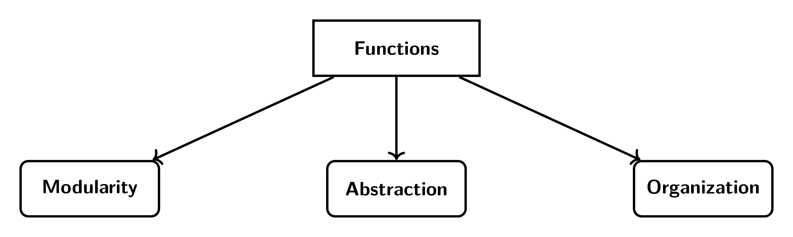

```{r setup, include=FALSE}
knitr::opts_chunk$set(cache = FALSE,
                      echo = TRUE,
                      warning = FALSE,
                      message = FALSE,
                      progress = FALSE, 
                      verbose = FALSE,
                      dev = 'png',
                      fig.height = 3,
                      dpi = 300,
                      fig.align = 'center')

options(htmltools.dir.version = FALSE)


miamired = '#C3142D'

if(require(pacman)==FALSE) install.packages("pacman")
if(require(devtools)==FALSE) install.packages("devtools")
if(require(countdown)==FALSE) devtools::install_github("gadenbuie/countdown")
if(require(xaringanExtra)==FALSE) devtools::install_github("gadenbuie/xaringanExtra")
if(require(urbnmapr)==FALSE) devtools::install_github('UrbanInstitute/urbnmapr')
if(require(emo)==FALSE) devtools::install_github("hadley/emo")

knitr::knit_engines$set(python = reticulate::eng_python)
```

```{r xaringan-themer, include=FALSE, warning=FALSE}
if(require(xaringanthemer) == FALSE) install.packages("xaringanthemer")
library(xaringanthemer)

style_mono_accent(base_color = "#84d6d3",
                  base_font_size = "20px")

xaringanExtra::use_xaringan_extra(c("tile_view", "tachyons", "panelset", "search", "fit_screen", "editable", "clipboard"))

xaringanExtra::use_extra_styles(
  hover_code_line = TRUE,
  mute_unhighlighted_code = TRUE
)
```


## Quick Refresher of Last Class

`r emo::ji("check")` Use pseudocode to map out a problem. 

`r emo::ji("check")` Python syntax, data types, and data structures.

`r emo::ji("check")` Convert data types using type casting. 

`r emo::ji("check")` Manipulate lists and use methods on lists.  


---

## Learning Objectives for Today's Class

- Understand the anatomy of a Python function, use arguments correctly, and construct your first function.   

- Utilize built-in and anonymous functions (`map`, `lambda`, `filter`).  

- Analyze your second dataset. 


---
class: inverse, center, middle

# The Anatomy of a Python Function

---

## One Motivation for Functions

- **Reusability**: Functions allow you to reuse code.

```{r dry_image, echo=FALSE, out.width="62%", fig.alt="A schematic of the DRY principle, with the acronym is explained as Do not repeat yourself. Then, the figure states that this is the first rule of coding"}

knitr::include_graphics("https://miro.medium.com/v2/resize:fit:720/format:webp/1*qIS9MRHvCR5g-CgRU_cAQw.png")
```

.footnote[
<html>
<hr>
</html>

**Source:** Sonika Baniya (2021).  [First rule of coding: DRY (Don't Repeat Yourself)](https://sonikabaniya.medium.com/first-rule-of-coding-dry-dont-repeat-yourself-cfecc19449a5).
]


---

## What is a Function?

- A function is a **block of reusable code** that only runs when called.  

```{r run_latex_file, echo=FALSE, cache=TRUE, results='hide'}
tinytex::xelatex('../../figures/functions.tex')
pdftools::pdf_convert('../../figures/functions.pdf', dpi = 600,
                      filenames = '../../figures/functions.png')
```

```{r read_functions_chart, echo=FALSE, out.width='90%', fig.alt="Three advantages of functions: modularity, abstraction, and organization.", fig.align='center'}

```


.footnote[
<html>
<hr>
</html>

**Image Credits:** Created by the author (Fadel M. Megahed) for our ISA 419 course.
]

  
???

**Modularity:** Functions allow you to reuse code in different programs.

**Abstraction:** Functions allow you to focus on the big picture.

**Organization:** Functions allow you to break down your code into smaller, more manageable pieces.  

---

## Recall: Python List Functions

`r countdown(minutes = 4, seconds = 0, top = 0, font_size = "2em")`

.panelset[

.panel[.panel-name[Task]

- In [class02](https://fmegahed.github.io/isa419/spring2024/class02/02_python_basics.html), we introduced the following functions: `len()`, `max()`, `min()`, `sum()`, `sort()`, `index()`, `append()`, `pop()`, and `remove()`.

- For each of the above functions, what do you expect the function to **return**?  

- How is the name of the function related to the **action** it performs?
]


.panel[.panel-name[Q1]
1. For each of the above functions, what do you expect the function to **return**? 

.font90[
.can-edit.key-activity5a[
- `len()`: Edit me.  
- `max()`: Edit me.  
- `min()`: Edit me.  
- `sum()`: Edit me.  
- `sort()`: Edit me.
- `index()`: Edit me.  
- `append()`: Edit me.  
- `pop()`: Edit me.  
- `remove()`: Edit me.  
]
]
]

.panel[.panel-name[Q2]

- How is the name of the function related to the **action** it performs?

.can-edit.key-activity5b[
- Edit me.
]
]

]


---

## The Anatomy of a Python Function

```{python add_numbers}
def add_numbers(a, b):                       # `A: The function definition`
    
    """ This function sums two numbers """   # `B: The docstring`
    
    result = a + b                           # `C: The body of the function`
    return result                            # `C: The body of the function`


# Using the function
add_numbers(3, 5)                            # `D: Calling the function`

```

.footnote[
<html>
<hr>
</html>


**Footnotes:** 

  - Everything **within the function**, post the definition line, **is indented**.  
  - Vertical spacing here is for clarity, but not required (and likely violates Python's best practies).  
]
---

## The Anatomy of a Python Function (Cont.)

.font80[
**A: The function definition:**   
  - `def` is a .bold[keyword] that tells Python you are defining a function.  
  - `add_numbers` is the .bold[name] of the function, which should always be followed by parentheses and a colon.  
  - `a` and `b` are the .bold[parameters] of the function.  
  
**B: The docstring:**  
  - Optional: A .bold[docstring] is a string that describes what the function does.   
  
**C: The body of the function:**  
  - This is where the function does its work.  
  - The body is indented.  
  - Typically includes a `return` statement at the end.  
  
**D: Calling the function:**  
  - This is where you .bold[call] the function, i.e., tell Python to execute the code inside your function.  
]


---

## Python Parameters vs Arguments  

.pull-left[
- **Parameters** are the variables in the function definition.  
  + `a` and `b` are the parameters in the `add_numbers` function.  
  
- **Arguments** are the values passed to the function when it is called.  
  + `3` and `5` are the arguments in the `add_numbers` function.
]

.pull-right[
```{python parameters_arguments, ref.label='add_numbers'}

```
]

---

## Python Parameters and Arguments

Python allows for several methods of passing arguments to a function. These include, but are not limited to the following:  

- **Positional Arguments**: The arguments are passed to the function in the order in which they are defined.  

- **Keyword Arguments**: The arguments are passed to the function with the parameter name.  

- **Combination of Positional and Keyword Arguments**: The arguments are passed to the function in the order in which they are defined, .bold[followed by the keyword arguments].  


---

## Class Activity: Modify the `add_numbers` Function

`r countdown(minutes = 3, seconds = 0, top = 0, font_size = "2em")`  

Modify the function `add_numbers` to take a list of numbers and return the sum of the numbers.  

```{python add_numbers2}
# Hints:
# ------
# 1. Change the function name to `sum_numbers` 
#    (so you do not have two functions with the same name).  
# 2. Change the parameters to a single parameter named `numbers_list`.  
# 3. Capitalize on the fact that the parameter input is now a list.
```

---

## Functions: Good Practices

- **Function Name:** Choose a descriptive name for your function.   
  + The name should describe what the function does.

- **Type Hints:** You can specify the type of the parameters and the return type.  
  + This is **not enforced by Python**, but it is a good practice.
  + For example:  
      * `def add_numbers(a: int, b: int) -> int:` or  
      * `def add_numbers(a: float, b: float) -> float:`.  

- **Docstrings:** Always include a docstring to describe what the function does.  
  + This is a good practice and is used by Python's built-in `help()` function.  

- **Return Statement:** Always include a `return` statement.  
  + If you do not include a `return` statement, the function will return `None`.  


---
class: inverse, center, middle

# Built-In and Anonymous Functions in Python (`map`, `lambda`, `filter`)

---

## The `map` Function

.pull-left[
- The `map` function applies a given function to each item of an *iterable* (e.g., `list`). Its synatx is: 
  + `map(function, iterable)`.  
      * The `function` is the function we want to apply.  
      * The `iterable` is what we want to apply the function across.   
  
- The `map` function returns a **map object**, which is an iterator.

- To get the **results**, you must *type convert* the map object to a list.  
]

.pull-right[
```{python map_function}
def square(x: float) -> float:
    """This function squares a number"""
    return x ** 2
  
# Using the map function
numbers = [1, 2, 3, 4, 5]
map_operation = map(square, numbers)
squared_numbers = list(map_operation)

print('The map operation:', map_operation, '\n\n', 'The squared numbers:', squared_numbers, sep ='\n')
```
]


---

## The `lambda` Function

- The `lambda` function is an **anonymous function**, defined using the `lambda` keyword:   
    + **Anonymous:** They are **not** declared in the standard manner by using the `def` keyword.  
    + **Compact:** They allow writing functions in a concise way, often for short-term/throwaway functions.     
    + **Single Expression:** The body of a lambda is limited to just one expression. No statements or annotations are allowed; the function body is purely a single expression.
    
```{r lambda_function_image, echo=FALSE, out.width='50%', fig.alt="A schematic of the lambda function, with the keyword lambda followed by the parameters and a colon, and then the expression to be evaluated."}
knitr::include_graphics("https://miro.medium.com/v2/resize:fit:4800/format:webp/0*4eRr7IZ3sP2ZAE8H.png")
```

.footnote[
<html>
<hr>
</html>

**Image Source:** John Vastola (2021). [Mastering Lambda Expressions in Python: A Hands-On Guide](https://levelup.gitconnected.com/mastering-lambda-expressions-in-python-a-hands-on-guide-e6f380701e96).
]


---

## The `lambda` Function (Cont.)

```{python lambda_function2}
numbers = [1, 2, 3, 4, 5]

map_operation = map(lambda x: x ** 2, numbers)

squared_numbers = list(map_operation)

print(
  'The map operation:', map_operation, '\n', 
  'The squared numbers:', squared_numbers, sep ='\n'
)
```


---

## The `filter` Function

.pull-left[
- The `filter` function constructs an iterator from elements of an iterable for which a function returns `True`.  
  + Its syntax is: `filter(function, iterable)`.  
  
- The `filter` function returns a **filter object**, which is an iterator.  

- To get the **results**, you must *type convert* the filter object to a list.
]

.pull-right[
```{python filter_function}
def is_even(x: int) -> bool:
    """This function checks if a number is even"""
    return x % 2 == 0

# Using the filter function
numbers = [1, 2, 3, 4, 5]
filter_step = filter(is_even, numbers)
even_numbers = list(filter_step)

print('The filter operation:', filter_step, '\n', 
'The even numbers:', even_numbers, sep ='\n')

```
]


---

## Evaluating your Understanding so Far: A Kahoot

.bold[Let's evaluate your understanding of the material so far]  

- Go to [Kahoot](https://kahoot.it) and enter the game pin shown on screen.  

- You will be asked to answer **7 multiple choice questions**.  

- You will receive **points** for answering each question **correctly** and **quickly**, i.e., your points are impacted by your speed in addition to obviously answering each question correctly.  

- The winner `r icons::icon_style(icons::fontawesome("trophy", style = "solid"), fill = 'gold')` (i.e., the one with the most points after the 7 questions) receives a $10 Starbucks `r icons::icon_style(icons::fontawesome("coffee", style = "solid"), fill = 'green')` gift card. 

---
class: inverse, center, middle

# Analyzing Your Second Dataset

---

## Analyzing a Simulated Equifax Breach Dataset

`r countdown(minutes = 15, seconds = 0, top = 0, font_size = "2em")`

.panelset[
.panel[.panel-name[Task]

- Download the `simulated_equifax_breach_data.csv` file from [Canvas](https://miamioh.instructure.com/courses/229048/files/34627330?module_item_id=5789098).  

- Load the dataset into [Google Colab](https://colab.research.google.com/).  

- Answer the questions in the next tabs.  

- You can work in groups of 2-3 students.  
]

.panel[.panel-name[Task 1]

- Build on this code to print the first 5 rows of `ssn`.  

```{python read_csv}
import pandas as pd

# you will NOT need to have the same folder structure as I do
equifax_df = pd.read_csv('../../data/simulated_equifax_breach_data.csv')

# converting the pandas df into lists since we have not discussed pandas yet
name = list(equifax_df['Name'])
address = list(equifax_df['Address'])
phone_num = list(equifax_df['Phone Number'])
date_of_birth = list(equifax_df['Date of Birth'])
ssn = list(equifax_df['Social Security Number'])
driver_license = list(equifax_df['Driver License Number'])

type(phone_num) # what type of object is this?
```
]

.panel[.panel-name[Task 2]

- Count the number of observations in our dataset, through the length of any of the lists.  

```{python count_observations}
# Hints:
# ------
# We have talked about this in class, in our discussion of list functions.
```

```{python count_observations_solution, include=FALSE}
len(name)
```
]

.panel[.panel-name[Task 3]

- How many unique names are in the dataset?  

```{python unique_names}
# Hints:
# ------
# 1. Use `type casting` to convert the list into a `type that only stores unique values`.  
# 2. Use the `len()` function to count the number of unique names.  
```

```{python unique_names_solution, include=FALSE}
unique_names = len(set(name))
```

]


.panel[.panel-name[Task 4]

- Use `map()` and `lambda` to extract area codes from phone numbers.

```{python area_codes}
# Hints:
# ------
# 1. Use the `map()` function to apply a lambda function to each phone number.
# 2. Use the `lambda` function to extract the first 3 digits of each phone number.
# 3. Convert the map object to a `list` to see the results.  
```

```{python area_codes_solution, include=FALSE}
area_codes = list(map(lambda x: x[:3], phone_num))
```
]


.panel[.panel-name[Task 5]

- Use `filter()` to count the number of people from Butler County (i.e., area code 513).

```{python butler_county}
# No hints provided; you are a pro now :)  
```

```{python butler_county_solution, include=FALSE}
butler_county = list(filter(lambda x: x[:3] == '513', area_codes))
len(butler_county)

# Explain the code above
# -----------------------
# 1. We use the `filter()` function to apply a lambda function to each area code.  
# 2. The `lambda` function checks if the first 3 digits of the phone number are '513'.  
# 3. We convert the filter object to a `list` and then use the `len()` function to count the number of people from Butler County.  
```
]

]


---
class: inverse, center, middle

# Recap

---

## Summary of Main Points

By now, you should be able to do the following:  

- Understand the anatomy of a Python function, use arguments correctly, and construct your first function.  

- Utilize built-in and anonymous functions (`map`, `lambda`, `filter`).  

- Analyze your second dataset.

---

## 📝 Review and Clarification 📝

1. **Class Notes**: Take some time to revisit your class notes for key insights and concepts.
2. **Zoom Recording**: The recording of today's class will be made available on Canvas approximately 3-4 hours after the end of class.
3. **Questions**: Please don't hesitate to ask for clarification on any topics discussed in class. It's crucial not to let questions accumulate. 