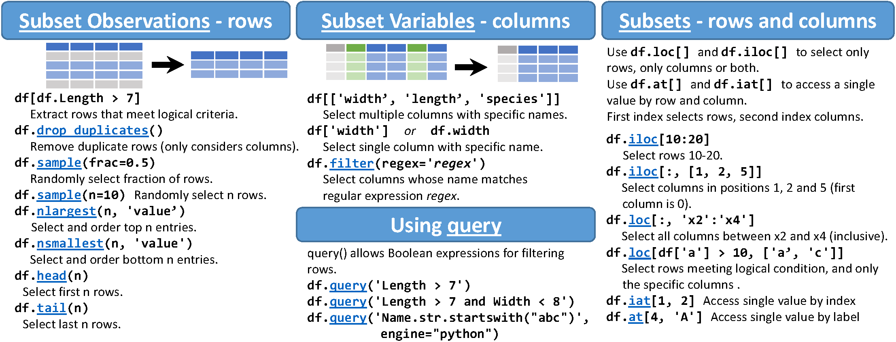

```{r setup, include=FALSE}
knitr::opts_chunk$set(cache = FALSE,
  echo = TRUE,
  warning = FALSE,
  message = FALSE,
  progress = FALSE, 
  verbose = FALSE,
  dev = 'png',
  fig.height = 3,
  dpi = 300,
  fig.align = 'center')

options(htmltools.dir.version = FALSE)


miamired = '#C3142D'

if(require(pacman)==FALSE) install.packages("pacman")
if(require(devtools)==FALSE) install.packages("devtools")
if(require(countdown)==FALSE) devtools::install_github("gadenbuie/countdown")
if(require(xaringanExtra)==FALSE) devtools::install_github("gadenbuie/xaringanExtra")
if(require(urbnmapr)==FALSE) devtools::install_github('UrbanInstitute/urbnmapr')
if(require(emo)==FALSE) devtools::install_github("hadley/emo")

knitr::knit_engines$set(python = reticulate::eng_python)
```

```{r xaringan-themer, include=FALSE, warning=FALSE}
if(require(xaringanthemer) == FALSE) install.packages("xaringanthemer")
library(xaringanthemer)

style_mono_accent(base_color = "#84d6d3",
        base_font_size = "20px")

xaringanExtra::use_xaringan_extra(c("tile_view", "tachyons", "panelset", "search", "fit_screen", "editable", "clipboard"))

xaringanExtra::use_extra_styles(
  hover_code_line = TRUE,
  mute_unhighlighted_code = TRUE
)
```


## Quick Refresher of Last Class

`r emo::ji("check")` Understand the anatomy of a Python function, use arguments correctly, and construct your first function.    

`r emo::ji("check")` Utilize built-in and anonymous functions (`map`, `lambda`, `filter`).  

`r emo::ji("check")` Analyze your second dataset.  


---

## Learning Objectives for Today's Class

- Describe and create data frames  

- Import data using pandas  

- Utilize the `head()`, `tail()`, `shape()`, `info()`, `dtypes()`, `count()`, `value_count()`, `describe()`, `isnull().sum()` functions to quickly explore and summarize your dataset  

- Use the `loc[]` and `iloc[]` to select rows and columns  

- Use `assign()` to create new columns on your existing data frame.


---
class: inverse, center, middle

# Describing and Creating Data Frames

---

## What is Pandas?   

- Along with [polars](https://pola.rs/), it is one of the most popular data analysis and manipulation libraries in Python, designed to make working with 'relational' or 'labeled' data both easy and intuitive. 

- pandas supports the integration with many file formats or data sources out of the box (csv, excel, sql, json, parquet,…). Importing data from each of these data sources is provided by function with the prefix `read_*`. Similarly, the `to_*` methods are used to store data.  

[](https://pandas.pydata.org/)

.footnote[
<html>
<hr>
</html>

**Source:** The content and image are from the *Getting Started with Pandas* description in [pandas.pydata.org](https://pandas.pydata.org/docs/getting_started/index.html). The image can be directly accessed [here](https://pandas.pydata.org/docs/_images/02_io_readwrite.svg).
]


---

## What is a Data Frame?

.pull-left[
- A data frame is a two-dimensional, size-mutable, potentially heterogeneous tabular data structure with labeled axes (rows and columns).  

- It is a primary data structure in pandas.  

- It is similar to a spreadsheet or SQL table, or a dictionary of Series objects.  

- It is generally the most commonly used pandas object.
]

.pull-right[
```{r df_pic, echo=FALSE, out.width="100%", fig.alt='A data frame is a two-dimensional, size-mutable, potentially heterogeneous tabular data structure with labeled axes (rows and columns).'}
knitr::include_graphics('https://pandas.pydata.org/docs/_images/01_table_dataframe.svg')
```
]


.footnote[
<html>
<hr>
</html>

**Image Source:** The image is from the *Getting Started with Pandas* description in [pandas.pydata.org](https://pandas.pydata.org/docs/getting_started/index.html). The image can be directly accessed [here](https://pandas.pydata.org/docs/_images/01_table_dataframe.svg).
]


---

## What is a Series?

.pull-left[

- Each column in a `DataFrame` is a `Series`. 

- When **selecting a single column of a pandas** `DataFrame`, the **result** is a pandas `Series`. To select the column, use the *column label* in between square brackets `[]`.  

- A Series is a one-dimensional data structure capable of holding data of any type (integer, string, float, python objects, etc.); it is **somewhat similar** to a list/dictionary.

]

.pull-right[
[](https://pandas.pydata.org/)
]


.footnote[
<html>
<hr>
</html>

**Source:** The content and image are from the *Getting Started with Pandas* tutorial titled: [What kind of data does pandas handle?](https://pandas.pydata.org/docs/getting_started/intro_tutorials/01_table_oriented.html#min-tut-01-tableoriented) The image can be directly accessed [here](https://pandas.pydata.org/docs/_images/01_table_series.svg).
]


---

## Creating a Series

We can easily create a `Series` from a list, or a dictionary. 

.pull-left[

**From a List**

```{python from_a_list}
import pandas as pd

# Creating a Series from a list
lst = [3, 5, 7, 9]
s1 = pd.Series(lst)
print(s1)
```
]

.pull-right[

**From a Dictionary**

```{python from_a_dict}
import pandas as pd

# Creating a Series from a dictionary
d = {'a': 3, 'b': 5, 'c': 7, 'd': 9}
s2 = pd.Series(d)
print(s2)
```
]

**What are the differences between the two created series?**

.can-edit.key-activity6[
Edit me to answer the question.
]


---

## Creating a Data Frame

- There are several ways, where we can create a `DataFrame` in pandas. These include:

.pull-left[
**From a Dictionary of Lists**

```{python from_dict_of_lists}
import pandas as pd

# DataFrame from a dictionary of lists
l1 = [1, 5]
l2 = [2, 10]
data = {'a': l1, 'b': l2, 'c': [20, 30]}
df1 = pd.DataFrame(data)
print(df1)
```
]


.pull-right[

**From a List of Dictionaries**

```{python from_list_of_dicts, highlight.output=c(2)}
import pandas as pd

# DataFrame from a list of dictionaries
dict1 = {'a': 1, 'b': 2}
dict2 = {'a': 5, 'b': 10, 'c': 20}
data = [dict1, dict2]
df2 = pd.DataFrame(data)
print(df2)
```
]


**Note the highlighted row in the second code chunk. What happened there?**

.can-edit.key-activity7[
Edit me to answer the question.
]

---

## Class Activity: Creating a Data Frame

`r countdown(minutes = 4, seconds = 0, top = 0, font_size = "2em")`

.panelset[

.panel[.panel-name[Task]

- Use [Google Colab](https://colab.research.google.com/) to identify the correct piece of code that can be used to create two data frames: (a) a data frame from a single list, and (b) a data frame from two lists. 

```{python task1, eval=FALSE}
import pandas as pd

my_lst = [1, 5, 2, 10]
df3 = pd.DataFrame(my_lst)

# A data frame from two lists
l1 = [1, 5]
l2 = [2, 10]

# which of these produces the expected result,
# where l1 and l2 are the columns of the data frame?
df4a = pd.DataFrame(l1, l2)
df4b = pd.DataFrame((l1, l2))
df4c = pd.DataFrame([l1, l2])
df4d = pd.DataFrame(zip(l1,l2))
```
]

.panel[.panel-name[Comments]

After running the code in [Google Colab](https://colab.research.google.com/), use the space below to write down **the correct data frame numbers** that can be used to create the two data frames: (a) a data frame from a single list, and (b) a data frame from two lists.   

<b style='color:black !important;'>Note the following:</b>   
  - There are multiple ways to construct a data frame from two lists.  
  - The results are <b style='color:black !important;'>not as pretty</b> as the ones we have seen before; but, this can be easily fixed.   
      + <b style='color:black !important;'>Why?</b> **Write down your answer in the next panel.**  
      + <b style='color:black !important;'>Take note of how in Fadel's walk through.</b>
]

.panel[.panel-name[Your Answer]

.can-edit.key-activity8[

- **Data Frame from a single list:**  Edit me to answer the question.

- **Data Frame from two lists:**  Edit me to answer the question.  

- **Why are the results not as pretty as the ones we have seen before?**  Edit me to answer the question.  
]

]
]


---
class: inverse, center, middle

# Importing Data Using Pandas

---

## Importing Data Using Pandas

[](https://pandas.pydata.org/)

.footnote[
<html>
<hr>
</html>

**Source:** The image is from the *Getting Started with Pandas* tutorial available at [pandas.pydata.org](https://pandas.pydata.org/docs/getting_started/index.html). The image can be directly accessed [here](https://pandas.pydata.org/docs/_images/02_io_readwrite.svg).
]


---

## Things to Consider while Importing Data with Pandas

.font90[
- **Check the file extension:** Your <b style='color:black !important;'>choice of function</b> will depend on the file extension.  

- **Check the file path:**   
    + **Local file:**   
        * If the file is in the <b style='color:black !important;'>same directory</b> as your code, you can simply provide the <b style='color:black !important;'>file name</b>.  
        * <b style='color:black !important;'>Otherwise</b>, you will need to provide the <b style='color:black !important;'>path</b> to the file.  
    + **Remote file:** You will need to provide the <b style='color:black !important;'>URL to the file</b>.

- **Inspect the file:** to know which <b style='color:black !important;'>default parameter values must be changed</b>. Things to consider:    
    + Delimiter (in the case of .txt files)  
    + Header (does it exist? if not, what should be used as column names?) 
    + Index Column (if it exists, what is it? if not, what should be used as the index?)  
    + Encoding (to be changed if file is not in English, or has names such as: François, José, Weiß, etc.) 
    + Date Format (if the file has dates, what is the format?) 
    + etc.
]


---

## Importing Data Using Pandas: CSVs

```{r read_csv_api, echo=FALSE}
knitr::include_url('https://pandas.pydata.org/docs/reference/api/pandas.read_csv.html', height = "490px")
```

.footnote[
<html>
<hr>
</html>

**Source:** The content is from the `pandas.read_csv()` documentation available at [pandas.pydata.org](https://pandas.pydata.org/docs/reference/api/pandas.read_csv.html).
]

---

## Importing Data Using Pandas: CSVs [Example 1]

Here is how you can import the **Simulated Equifax Breach Dataset** from a local file. 

```{python equifax_logs1}
import pandas as pd

equifax_df1 = pd.read_csv('../../data/simulated_equifax_breach_data.csv')
equifax_df1.head()
```


---

## Importing Data Using Pandas: CSVs [Example 2]

Here is how you can import the **Simulated Equifax Breach Dataset** from a remote file.

```{python equifax_logs2}
import pandas as pd

equifax_df2 = pd.read_csv('https://raw.githubusercontent.com/fmegahed/isa419/main/data/simulated_equifax_breach_data.csv')
equifax_df2.head()
```

---

## Importing Data Using Pandas: XML [Example 3]

Here is how you can import the **open threat feeds** from the [ICS Sans API](https://isc.sans.edu/api/#threatfeeds). 

```{python read_xml_api, cache = TRUE}
open_threats = pd.read_xml('https://isc.sans.edu/api/threatfeeds/')
open_threats.head()
```


---

## Importing Data Using Pandas: JSON [Example 4]

Here is how you can import the *Scapy Python Package Issues* from the [GitHub API](https://api.github.com/repos/secdev/scapy/issues). Note that *Scapy* is a powerful interactive packet manipulation package in Python (often used in *Pen Testing* and *Forensic Investigations*). 

```{python read_json_api, cache = TRUE}
import pandas as pd

# Reading JSON data
scapy_issues = pd.read_json('https://api.github.com/repos/secdev/scapy/issues')
scapy_issues.head()
```


---
class: inverse, center, middle

# Exploring and Summarizing Data

---

## Exploring and Summarizing Data

.font90[

| Function | Description  | Usage  |
|----------|------------------------|-------------|
| `head()` | Returns the first `n` rows (default = 5) for the object based on position. | `equifax_df2.head()` |
| `tail()` | Returns the last `n` rows (default = 5) for the object based on position. | `equifax_df2.tail()`  |
| `shape`  | Returns the number of rows and columns in the DataFrame.     | `equifax_df2.shape` |
| `info()` | Prints information about the DataFrame, including the number of entries, the column names, and the data types.  | `equifax_df2.info()`|
| `dtypes` | Returns the data types of the columns.   | `equifax_df2.dtypes`  |

]


---

## Exploring and Summarizing Data (Cont.)

.font90[

| Function | Description  | Usage |
|----------|--------------|-------|
| `count()`    | Returns the number of non-null values in each DataFrame column.   | `equifax_df2.count()`  |
| `value_counts()`  | Returns the frequency counts for each unique value in a column. <br> **Note: Applied per column.**   | `equifax_df2['Name'].value_counts()`   |
| `nunique()`  | Returns the number of unique values in a column. <br> **Note: Applied per column.**    | `equifax_df2['Name'].nunique()`  |
| `describe()`  | Provides descriptive statistics for numerical columns, but can also be used for object columns with `include='all'` parameter.    | `equifax_df2.describe()`|
| `isnull().sum()`  | Returns the count of missing values (`NaN`) in each column.    | `equifax_df2.isnull().sum()` |

]


---

## Explore and Summarize the Equifax Breach Dataset

`r countdown(minutes = 5, seconds = 0, top = 0, font_size = "2em")`

.panelset[
.panel[.panel-name[Task]

- Download the `simulated_equifax_breach_data.csv` file from [Canvas](https://miamioh.instructure.com/courses/209406/files/30864588?module_item_id=5050989).  

- Load the dataset into [Google Colab](https://colab.research.google.com/).  

- Using **pandas**, answer the questions in the next tabs. Note the first three are identical to what we did in the [previous class](https://fmegahed.github.io/isa419/spring2024/class03/03_python_functions.html?panelset1=task2&panelset2=task3&panelset3=task4#21)
]

.panel[.panel-name[Task 1]

- Display the first 5 rows of the dataset.  

```{python equifax_activity1, include = F}
import pandas as pd
equifax_df = pd.read_csv('../../data/simulated_equifax_breach_data.csv')
equifax_df.head()
```
]

.panel[.panel-name[Task 2]

- Count the number of observations in our dataset.  

```{python equifax_activity2, include = F}
equifax_df.shape
```
]


.panel[.panel-name[Task 3]

- How many unique names are in the dataset? 

```{python equifax_activity3, include = F}

equifax_df['Name'].nunique()
```
]

.panel[.panel-name[Task 4]

- What are the type of the columns in the dataset?  

```{python equifax_activity4, include = F}
equifax_df.info()
```
]

.panel[.panel-name[Task 5]

- What are the descriptive statistics for the numeric columns in the dataset?  

```{python equifax_activity5, include = F}
equifax_df.describe()
```
]

]


---
class: inverse, center, middle

# Subsetting Data in Pandas

---

## Subsetting Observations/Rows in Pandas

[](https://pandas.pydata.org/Pandas_Cheat_Sheet.pdf)

.footnote[

**Source:** The image is cropped from the [Pandas Cheat Sheet](https://pandas.pydata.org/Pandas_Cheat_Sheet.pdf). 
]

---

## Common Issues with Subsetting

- A common issue when **subsetting rows is that the index is not reset**, i.e., the index of the original data frame is retained. This <b style='color:black !important;'>can be problematic in the following subsequent scenarios:</b>

    + When you want to subset the data frame using the `iloc[]` or `loc[]` functions.  
    + When you want to access the data frame using `.iat[]`.  
    
To <b style='color:black !important;'>overcome this issue</b>, use the **method `.reset_index(drop=True)`** to reset the index of the data frame.


---

## Common Issues with Subsetting (Cont.)

- The `query()` method **cannot handle column names with spaces**.  

- To <b style='color:black !important;'>overcome this issue</b>, we can do the following:   
    + first, use the **method `.rename()`** to rename the columns of the data frame;  
    + then, use the **method `.query()`** to subset the data frame.  
    
    **Example:** `df.rename(columns = {'old name': 'new_name'}, inplace = True)`
    
    **OR**  
    
    + Use the method **`.query()`** to subset the data frame, but use **backticks** to enclose the column names with spaces.  
    
    **Example:** ``df.query('`old name` > 5')``  
    
    **OR**  
    
    + Use `clean_names()` from the [pyjanitor](https://pyjanitor-devs.github.io/pyjanitor/) package to clean the column names, and then use, `query()` to subset the data frame.  


---
class: inverse, center, middle

# Creating New Columns in Pandas

---

## Creating New Columns in Pandas using `assign()`

- The `assign()` method is used to create new columns on your existing data frame.  

- It returns a new data frame with the new columns added to the original data frame.  

- The method takes the form: `df.assign(new_column_name = new_column_values)`.  
- The `new_column_values` can be a single value, a list, or a series.  

- The method can also be used to create multiple columns at once.


---

## Demo: Creating New Columns using `assign()`

In class, we will use `assign()` combined with `lambda` to create several new columns. 

```{r demo_pic, echo=FALSE, out.width="70%", fig.alt='A DALLE.E Created Figure of a Demo using the Prompt: Create a visually appealing and modern illustration that represents a code demonstration or programming workshop, suitable for a xaringan slide'}

```


```{python equifax_logs3, include = FALSE}
import pandas as pd
from janitor import clean_names
import datetime as dt

equifax_df = (
  pd.read_csv('../../data/simulated_equifax_breach_data.csv')
  .clean_names()
  .assign(
    first_name = lambda df: df['name'].str.split(' ').str[0], # extract the first name
    last_name = lambda df: df['name'].str.split(' ').str[-1], # extract the last name
    area_code = lambda df: df['phone_number'].str[:3], # extract the area code
    # additional columns created below [to be discussed in the next class]
    date_of_birth = lambda df: pd.to_datetime(df['date_of_birth']), # convert to datetime
    year_of_birth = lambda df: df['date_of_birth'].dt.year, # extract year
    month_of_birth = lambda df: df['date_of_birth'].dt.month, # extract month
    age = lambda df: dt.datetime.now().year - df['date_of_birth'].dt.year # calculate age
    )
)
```

.footnote[
<html>
<hr>
</html>

**Image Source:** The image was generated using [DALL·E](https://openai.com/dall-e/) on 2024-02-07.

**Bonus Tip:** We can use **`.reindex(columns = [some_list])`** to reorder/drop columns.
]


---
class: inverse, center, middle

# Recap

---

## Summary of Main Points

By now, you should be able to do the following:  

- Describe and create data frames  

- Import data using pandas  

- Utilize the `head()`, `tail()`, `shape()`, `info()`, `dtypes()`, `count()`, `value_count()`, `describe()`, `isnull().sum()` functions to quickly explore and summarize your dataset  

- Use the `loc[]` and `iloc[]` to select rows and columns  

- Use `assign()` to create new columns on your existing data frame.

---

## 📝 Review and Clarification 📝

1. **Class Notes**: Take some time to revisit your class notes for key insights and concepts.
2. **Zoom Recording**: The recording of today's class will be made available on Canvas approximately 3-4 hours after the end of class.
3. **Questions**: Please don't hesitate to ask for clarification on any topics discussed in class. It's crucial not to let questions accumulate. 