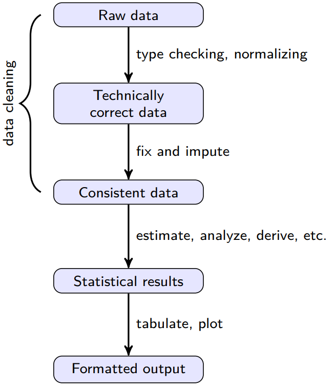
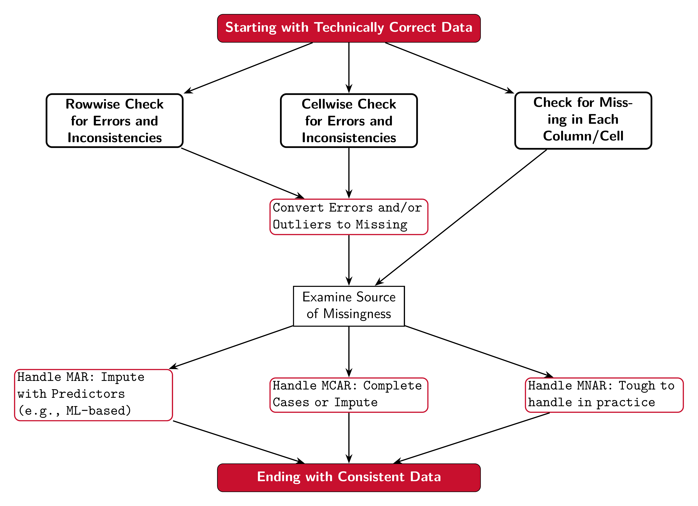

```{r setup, include=FALSE}
knitr::opts_chunk$set(cache = FALSE,
  echo = TRUE,
  warning = FALSE,
  message = FALSE,
  progress = FALSE, 
  verbose = FALSE,
  dev = 'png',
  fig.height = 3,
  dpi = 300,
  fig.align = 'center')

options(htmltools.dir.version = FALSE)


miamired = '#C3142D'

if(require(pacman)==FALSE) install.packages("pacman")
if(require(devtools)==FALSE) install.packages("devtools")
if(require(countdown)==FALSE) devtools::install_github("gadenbuie/countdown")
if(require(xaringanExtra)==FALSE) devtools::install_github("gadenbuie/xaringanExtra")
if(require(urbnmapr)==FALSE) devtools::install_github('UrbanInstitute/urbnmapr')
if(require(emo)==FALSE) devtools::install_github("hadley/emo")

knitr::knit_engines$set(python = reticulate::eng_python)
```

```{r xaringan-themer, include=FALSE, warning=FALSE}
if(require(xaringanthemer) == FALSE) install.packages("xaringanthemer")
library(xaringanthemer)

style_mono_accent(base_color = "#84d6d3",
        base_font_size = "20px")

xaringanExtra::use_xaringan_extra(c("tile_view", "tachyons", "panelset", "search", "fit_screen", "editable", "clipboard"))

xaringanExtra::use_extra_styles(
  hover_code_line = TRUE,
  mute_unhighlighted_code = TRUE
)
```


## Quick Refresher of Last Class

`r emo::ji("check")` Describe and create data frames  

`r emo::ji("check")` Import data using pandas  

`r emo::ji("check")` Utilize the `head()`, `tail()`, `shape()`, `info()`, `dtypes()`, `count()`, `value_count()`, `describe()`, `isnull().sum()` functions to quickly explore and summarize your dataset  

`r emo::ji("check")` Use the `loc[]` and `iloc[]` to select rows and columns  

`r emo::ji("check")` Use `assign()` to create new columns on your existing data frame.    


---

## Learning Objectives for Today's Class

- Ensure that your imported data is **technically correct** (rename columns and fix `dtypes`) 

- Clean data to ensure that your data is consistent  

- Understand the difference between `concatenate`, `merge`, and `join`.


---
class: inverse, center, middle

# Technically Correct Data

---

## The Data Analysis Value Chain

```{r data_analysis_chart, echo=FALSE, out.width='40%'}

```

.footnote[
<html>
<hr>
</html>
**Source:** [De Jonge and Van Der Loo (2013), An introduction to data cleaning with R](https://cran.r-project.org/doc/contrib/de_Jonge+van_der_Loo-Introduction_to_data_cleaning_with_R.pdf). Please click on the link and read p. 7-8.
]

---

## Technically Correct Data

> Raw data files may lack headers, contain wrong data types (e.g. numbers stored as strings), wrong category labels, unknown or unexpected character encoding and so on.

> **Technically correct data** is the state in which data can be read into an R data.frame, with correct **name**, **types** and **labels**, without further trouble. However, that **does not mean that the values are error-free or complete**. --- [De Jonge and Van Der Loo (2013)](https://cran.r-project.org/doc/contrib/de_Jonge+van_der_Loo-Introduction_to_data_cleaning_with_R.pdf)


---

## Functions for Cleaning/Renaming Variables

```{r functions_renaming, echo=FALSE}
library(gt)
tidyr <- tibble::tribble(
  ~ type, ~ `package_name`, ~ `fun()`, ~ `description`, 
  "**cleaning names**", "janitor", "clean_names()", "Resulting names are unique, consisting only <br> of the _ character, numbers, and letters",
  "**renaming**", "pandas", "df.rename(columns={'dept2': 'econ', 'dept3': 'isa'})", "Will rename the columns dept2 and dept3 to econ and isa",
  
)

tidyr |> 
  gt() |> 
  fmt_markdown(everything()) |> 
  cols_label(
    `type` = md("`type`"),
    `package_name` = md("`package`"),
    `fun()` = md("`function()`"),
    `description` = md("`description`"),
  ) |> 
  as_raw_html()

```


---

## An Example of Cleaning and Renaming Names

```{python clean_names}
import pandas as pd
import janitor

# Create a dataframe
df = pd.DataFrame(
  {'dept 1': [1, 2, 3], 'dept 2': [4, 5, 6], 'dept 3': [7, 8, 9]}
  )

df = (
  df
  # clean the column names
  .clean_names()
  # note that the column names are now separated with an underscore
  .rename(columns={'dept_2': 'econ', 'dept_3': 'isa'}) 
  )

df.head(n=2)
```


---

## Changing Column/Series Data Types

- **Pandas** has a function called `astype()` that can be used to change the data type of a column. To convert into a different data type, you can use the following syntax:  
    + **Int:**  `df['column_name'] = df['column_name'].astype('int')`  
    + **Categorical:**  `df['column_name'] = df['column_name'].astype('category')`  
    + **Datetime:**  `df['column_name'] = df['column_name'].astype('datetime64')`
    + **Numeric:**  `df['column_name'] = df['column_name'].astype('float')`
    + **String:**  `df['column_name'] = df['column_name'].astype('str')`
    + **Boolean:**  `df['column_name'] = df['column_name'].astype('bool')`

- Obviously, these can also be passed via the `assign()` function in **Pandas**. For example:   
`df = df.assign(column_name = df['column_name'].astype('int'))`.


---
class: inverse, center, middle

# Data Cleaning

---

## My Opinionated Perspective on Data Cleaning


```{r run_latex_file, echo=FALSE, cache=TRUE, results='hide'}
tinytex::xelatex('../../figures/data_cleaning_process.tex')
pdftools::pdf_convert('../../figures/data_cleaning_process.pdf', dpi = 600,
                      filenames = '../../figures/data_cleaning_process.png')
```

```{r read_data_cleaning_chart, echo=FALSE, out.width='68%', fig.alt="A flowchart depicting the process of data cleaning. The process involves checking for errors and inconsistencies, handling missing data, and ensuring the final dataset is consistent and ready for analysis.", fig.align='center'}

```

.footnote[
<html>
<hr>
</html>

**Reminders:** Please do not use mean/median imputation (they are awful). Also, please do not impute or `.dropna()` until you understand the nature of your missing data. 
]
    
---

## Additional Thoughts on Data Cleaning

- **Data cleaning** is the process of ensuring that your data is consistent and correct. This involves checking for errors and inconsistencies, handling missing data, and ensuring the final dataset is consistent and ready for analysis.

- **Data cleaning** is a critical step in the data analysis process. If you don't clean your data, you can't trust your results.  

- **Data cleaning** is a time-consuming process. It's not uncommon for data scientists to spend 80% of their time cleaning data and only 20% of their time analyzing it.

- **Data cleaning** is an iterative process. You'll often find that you need to go back and clean your data again after you've started analyzing it.

---

## Data Cleaning in Python

- **Pandas** has a number of functions that can be used to clean data. Some of the most common ones include:  
    + `drop_duplicates()`: Remove duplicate rows from a DataFrame.  
    + `dropna()`: Remove missing values from a DataFrame.  
    + `fillna()`: Fill missing values in a DataFrame (use with caution).  
    + `str.replace()`: Replace values in a Series.  
    + `str.strip()`: Remove leading and trailing whitespace from a Series.  
    + `str.extract()`: Extract values from a Series using a regular expression.  
    + `str.get_dummies()`: Convert a Series to dummy variables.  
    + `str.pad()`: Pad strings in a Series.   
    + `str.zfill()`: Pad strings in a Series with zeros.    


---
class: inverse, center, middle

# Combining Multiple DataFrames


---


## A Motivating Example for `merge()`

.pull-left[

A **df of IP addresses and counts**:

.font90[
```{python ip_df1, highlight.output=c(3)}

df1 = pd.DataFrame(
  {'ip': ['134.53.10.20', '134.53.355.200', '129.171.123.45'],
   'count': [10, 20, 30]}
  )

print(df1)
```
]
]

.pull-right[

A **df of IP addresses and cities**:

.font90[
```{python cities_df2, highlight.output=c(3)}
df2 = pd.DataFrame(
  {'ip': ['134.53.10.20', '69.12.18.100', '129.171.123.45'],
   'city': ['Oxford', 'Buffalo', 'Coral Gables']}
  )

print(df2)
```
]
]

**What are the differences between the two data frames**

.can-edit.key-activity9[
Edit me to answer the question.
]


---

## `merge()`: API Reference

```{r merge_api, echo=FALSE}
knitr::include_url("https://pandas.pydata.org/pandas-docs/stable/reference/api/pandas.DataFrame.merge.html", height = "500px")


```

---

## `merge()`: Syntax

- The `merge()` function in **Pandas** is used to merge two DataFrames. It is similar to the `join()` function in SQL.

- The `merge()` function takes the following arguments:  
    + `left`: The first DataFrame to merge.  
    + `right`: The second DataFrame to merge.  
    + `on`: The column to merge on.   
       * `left_on` and `right_on` can be used if the column names are different.  
    + `how`: The type of join to perform (e.g., 'inner', 'outer', 'left', 'right').  
    + `suffixes`: A tuple of strings to append to overlapping column names.  
    + `indicator`: If `True`, adds a column to the merged DataFrame indicating the source of each row.  
    + `validate`: If `True`, checks that the merge is unique.


---

## `merge()`

.pull-left[

**Default** `merge()`:
.font90[
```{python merge_df1}
df3 = pd.merge(df1, df2, on='ip')
print(df3)
```
]
]

.pull-right[

**Changing** the `how` to **left**:
.font90[
```{python merge_df2, highlight.output=c(2)}
df4 = pd.merge(df1, df2, on='ip', how='left')
print(df4)
```
]
]

**What are the differences between the two data frames?**

.can-edit.key-activity10[
Edit me to answer the question.
]


---

## `join()`: API Reference

```{r join_api, echo=FALSE}
knitr::include_url("https://pandas.pydata.org/pandas-docs/stable/reference/api/pandas.DataFrame.join.html", height = "500px")
```

---

## `join()`: Syntax

- The `join()` function is similar to the `merge()` function, but it is used to join DataFrames on their **indices**. The syntax for the `join()` function is as follows:  
    + `df1.join(df2)`: Join `df1` and `df2` on their indices.  
    + `df1.join(df2, how='left')`: Join `df1` and `df2` on their indices using a left join.  
    + `df1.join(df2, how='right')`: Join `df1` and `df2` on their indices using a right join.  
    + `df1.join(df2, how='inner')`: Join `df1` and `df2` on their indices using an inner join.  
    + `df1.join(df2, how='outer')`: Join `df1` and `df2` on their indices using an outer join.


---

## `concat()`: API Reference

```{r concat_api, echo=FALSE}
knitr::include_url("https://pandas.pydata.org/pandas-docs/stable/reference/api/pandas.concat.html", height = "500px")
```

---

## `concat()`: Syntax

- The `concat()` function can be used to concatenate DataFrames along rows or columns. The syntax for the `concat()` function is as follows:  
    + `pd.concat([df1, df2], axis=0)`: Concatenate DataFrames along rows, i.e., stack them on top of each other.  
    + `pd.concat([df1, df2], axis=1)`: Concatenate DataFrames along columns, i.e., stack them side by side.    
    + `pd.concat([df1, df2], axis=0, ignore_index=True)`: Concatenate DataFrames along rows, ignoring the index.  
    + `pd.concat([df1, df2], axis=1, join='inner')`: Concatenate DataFrames along columns, using the intersection of the columns.  
    + `pd.concat([df1, df2], axis=1, join='outer')`: Concatenate DataFrames along columns, using the union of the columns.
    

---

## Summary: Merge, Concat, and Join

- **Pandas** has a number of functions that can be used to combine DataFrames. Some of the most common ones include:  
    + `merge()`: Merge DataFrames using a database-style join. `merge()` can be used to perform inner, outer, left, and right joins on one or more common columns.   
    + `concat()`: Concatenate (stack) DataFrames along rows or columns.
    + `join()`: Join DataFrames using their indexes.  


---
class: inverse, center, middle

# A Demonstration of Combining Data Frames in a Cyber Security Context

---

## An Overview of our Two Datasets

```{python geo_location, include=FALSE, cache=TRUE}
import geoip2.database
import pandas as pd

def geolocate_ip(ip_addresses):
    # Load the GeoLite2 database
    reader = geoip2.database.Reader('../../data/GeoLite2-City.mmdb')

    geolocation_data = []
    counter = 0

    for ip_address in ip_addresses:
        try:
            # Get the geolocation information for the IP address
            response = reader.city(ip_address)

            # Extract relevant information
            country = response.country.name
            city = response.city.name
            latitude = response.location.latitude
            longitude = response.location.longitude

            geolocation_data.append([ip_address, country, city, latitude, longitude])
        except geoip2.errors.AddressNotFoundError:
            counter += 1

    # Close the reader
    reader.close()
    
    # Print the number of IP addresses that were not found in the database
    print(f'IP addresses not found: {counter}')

    # Create a DataFrame from the geolocation data
    df = pd.DataFrame(geolocation_data, columns=['IP', 'Country', 'City', 'Latitude', 'Longitude'])
    return df

# Example usage
ip_addresses = pd.read_csv(
  '../../data/listed_ip_90_all.csv', 
  header= None, names = ['ip', 'count', 'lastseen']
  )['ip'].tolist()

geolocation_df = geolocate_ip(ip_addresses)

geolocation_df.to_csv('../../data/ip_geolocation.csv', index=False)
```

.font90[
Our [Toxic IP Addresses dataset](https://raw.githubusercontent.com/fmegahed/isa419/main/data/listed_ip_90_all.csv) comes from [Stop Forum Spam](https://www.stopforumspam.com/downloads) and contains a list of IP addresses that have been reported as toxic. The dataset contains the following columns:  
  - `ip`: The IP address.  
  - `frequency`: The number of times that the IP address number has been reported during the 90 day period.  
  - `lastseen`: The date/time (UTC) when the IP address was last seen.

I used the `geoip2` library to geolocate the IP addresses in the dataset based on the [Maxmind GeoLite2 City Database](https://www.maxmind.com/en/accounts/974136/geoip/downloads). I saved the results in a CSV file called [ip_geolocation.csv](https://raw.githubusercontent.com/fmegahed/isa419/main/data/ip_geolocation.csv), containing five columns:  
  - `IP`: The IP address.  
  - `Country`: The country where the IP address is located.  
  - `City`: The city where the IP address is located.  
  - `Latitude`: The latitude of the IP address.  
  - `Longitude`: The longitude of the IP address.  
]


---

## Analyzing Toxic IPs and their Geolocations

`r countdown(minutes = 15, seconds = 0, top = 0, font_size = "2em")`

```{python activity_solution, include=FALSE, eval=FALSE}
import pandas as pd
from janitor import clean_names

# Load the Toxic IP Addresses dataset
toxic_ips = pd.read_csv('data/listed_ip_90_all.csv', header=None, names=['IP', 'Frequency', 'LastSeen'])

# Load the IP Geolocation dataset
geolocation = pd.read_csv('data/ip_geolocation.csv', header=0)

# Task 1
# Combine the toxic_ips and geolocation DataFrames
combined_df = pd.merge(toxic_ips, geolocation, on='IP', how = 'left')

combined_df.dropna(inplace=True)

combined_df.shape

# Task 2
# Ensure that the 'IP' column is unique in the combined DataFrame
combined_df = (
  combined_df
  .clean_names()
  .assign(
    ip = lambda df: df['ip'].astype('str'),
    lastseen = lambda df: df['lastseen'].astype('datetime64[ns]'),
    country = lambda df: df['country'].astype('str'),
    city = lambda df: df['city'].astype('str'),
  )
)

# Task 3: unique countries
unique_countries = combined_df['country'].nunique()


# Task 4: mean number of reports per IP address
mean_reports = combined_df['frequency'].mean()

# Task 5: Number of unique IP addresses reported in 2024.  

toxic_2024 = (
  combined_df.copy()
  .query("lastseen >= '2024-01-01'")
)
mean_reports_2024 = toxic_2024['frequency'].mean()
```

.panelset[

.panel[.panel-name[Task]

- Load the [Toxic IP Addresses dataset](https://raw.githubusercontent.com/fmegahed/isa419/main/data/listed_ip_90_all.csv) into a DataFrame called `toxic_ips`.  

- Load the [IP Geolocation dataset](https://raw.githubusercontent.com/fmegahed/isa419/main/data/ip_geolocation.csv) into a DataFrame called `geolocation`.  

- Answer the questions in the next tabs.  

- You can work in groups of 2-3 students.  
]


.panel[.panel-name[Task 1]

- Combine the `toxic_ips` and `geolocation` DataFrames using an appropriate function.  

- Drop any rows with missing values.  

- What are the number of columns and rows of the resulting DataFrame?  
]

.panel[.panel-name[Task 2]

- Ensure that the resulting DataFrame is technically correct.  

]


.panel[.panel-name[Task 3]

- Compute the number of unique countries from which the toxic IP addresses originate.  

]

.panel[.panel-name[Task 4]

- Compute the mean number of reports per IP address.

]


.panel[.panel-name[Task 5]

- Compute the number of unique IP addresses reported since the beginning of the year.  

]

]


---
class: inverse, center, middle

# Recap

---

## Summary of Main Points

By now, you should be able to do the following:  

- Ensure that your imported data is **technically correct** (rename columns and fix `dtypes`) 

- Clean data to ensure that your data is consistent  

- Understand the difference between `concatenate`, `merge`, and `join`.

---

## 📝 Review and Clarification 📝

1. **Class Notes**: Take some time to revisit your class notes for key insights and concepts.
2. **Zoom Recording**: The recording of today's class will be made available on Canvas approximately 3-4 hours after the end of class.
3. **Questions**: Please don't hesitate to ask for clarification on any topics discussed in class. It's crucial not to let questions accumulate. 

