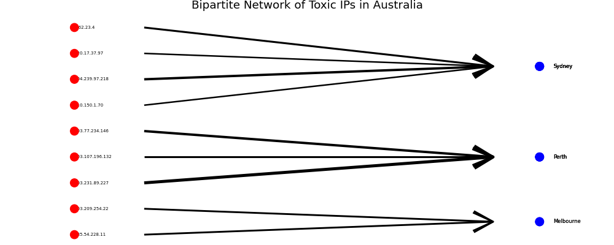

```{r setup, include=FALSE}
knitr::opts_chunk$set(cache = FALSE,
  echo = TRUE,
  warning = FALSE,
  message = FALSE,
  progress = FALSE, 
  verbose = FALSE,
  dev = 'png',
  fig.height = 3,
  dpi = 300,
  fig.align = 'center')

options(htmltools.dir.version = FALSE)


miamired = '#C3142D'

if(require(pacman)==FALSE) install.packages("pacman")
if(require(devtools)==FALSE) install.packages("devtools")
if(require(countdown)==FALSE) devtools::install_github("gadenbuie/countdown")
if(require(xaringanExtra)==FALSE) devtools::install_github("gadenbuie/xaringanExtra")
if(require(urbnmapr)==FALSE) devtools::install_github('UrbanInstitute/urbnmapr')
if(require(emo)==FALSE) devtools::install_github("hadley/emo")

knitr::knit_engines$set(python = reticulate::eng_python)
```

```{r xaringan-themer, include=FALSE, warning=FALSE}
if(require(xaringanthemer) == FALSE) install.packages("xaringanthemer")
library(xaringanthemer)

style_mono_accent(base_color = "#84d6d3",
        base_font_size = "20px")

xaringanExtra::use_xaringan_extra(c("tile_view", "tachyons", "panelset", "search", "fit_screen", "editable", "clipboard"))

xaringanExtra::use_extra_styles(
  hover_code_line = TRUE,
  mute_unhighlighted_code = TRUE
)
```


## Quick Refresher of Last Class

`r emo::ji("check")` Create quick visualizations using the `plot` method from [pandas](https://pandas.pydata.org/docs/user_guide/visualization.html) (with an understanding of the effect of different backends).  

`r emo::ji("check")` Utilize `auto-viz` type plots to create a quick EDA of your data.  


---

## Learning Objectives for Today's Class

- Utilize standalone data viz packages to construct and tailor your graphs.  

- Examine the use of network and/or spatial plots in the context of network data


---
class: inverse, center, middle

# Utilize Standalone Data Viz Packages to Construct and Tailor your Graphs

---

## Our Data

- We will use the `merged_ips` data set from a previous class to demonstrate how to plot data in pandas.

.font80[
```{python merged_ips}
import pandas as pd
import numpy as np

np.random.seed(2025) # so we get the same random sample

toxic_ips = pd.read_csv(
  "https://raw.githubusercontent.com/fmegahed/isa419/main/data/listed_ip_90_all.csv", 
  header = None, names = ['ip', 'frequency', 'lastseen']
)

geolocation = pd.read_csv(
  'https://raw.githubusercontent.com/fmegahed/isa419/main/data/ip_geolocation.csv', 
  names = ['ip', 'country', 'city', 'latitude', 'longitude']
)

merged_ips = (
  toxic_ips
  .merge(right = geolocation, how = 'left', on ='ip')
  .dropna()
  .assign( lastseen = lambda df: df['lastseen'].astype('datetime64[ns]') )
  .sample(1000) #<< a random sample of 1000 rows for faster plotting
  .query('frequency < 100')
)
```
]


---

## Grammar of Graphics

```{r gg, echo=FALSE, out.width = "80%", fig.alt = "The Grammar of Graphics"}
knitr::include_graphics("https://www.stat20.org/2-summarizing-data/03-a-grammar-of-graphics/images/grammar-of-graphics.png")
```


---

## The Grammar of Graphics with `plotnine`


```{python plotnine1, eval=FALSE, results="asis"}
from plotnine import ggplot, aes, geom_histogram, labs, theme_minimal

(
  ggplot(merged_ips) # data
)
```


---

## The Grammar of Graphics with `plotnine`


```{python plotnine2, eval=FALSE}
from plotnine import ggplot, aes, geom_histogram, labs, theme_minimal

(
  ggplot(merged_ips, aes(x = 'frequency') ) # data + aesthetics
)
```


---

## The Grammar of Graphics with `plotnine`


```{python plotnine3, eval=FALSE}
from plotnine import ggplot, aes, geom_histogram, labs, theme_minimal

(
  ggplot(merged_ips, aes(x = 'frequency') ) + # data + aesthetics
  geom_histogram(bins = 20) # geometry
)
```


---

## The Grammar of Graphics with `plotnine`


```{python plotnine4, eval=FALSE}
from plotnine import ggplot, aes, geom_histogram, labs, theme_minimal

(
  ggplot(merged_ips, aes(x = 'frequency') ) + # data + aesthetics
  geom_histogram(bins = 20) + # geometry
  labs(title = 'Frequency of Toxic IPs', x = 'Frequency', y = 'Count') + # labels
  theme_minimal() # theme
)
```


---

## Class Activity

`r countdown(minutes = 5, seconds = 0, top = 0, font_size = "2em")`

.panelset[

.panel[.panel-name[Task]

- After going through the [plotnine Reference and Gallery tabs](https://plotnine.org/), create a scatter plot of the `latitude` and `longitude` variables from the `merged_ips` data set using `plotnine`.  

- Add a title to the plot and label the x and y axes.

- Use the `theme_minimal` theme.  


]

.panel[.panel-name[Solution]

```{python plotnine5, include=FALSE}
from plotnine import ggplot, aes, geom_point, labs, theme_minimal

scatter = (
  ggplot(merged_ips, aes(x = 'longitude', y = 'latitude') ) + # data + aesthetics
  geom_point() + # geometry
  labs(title = 'Geolocation of Toxic IPs', x = 'Longitude', y = 'Latitude') + # labels
  theme_minimal() # theme
)
```
]
]


---
class: inverse, center, middle

# Examine the Use of Network Plots in the Context of Network Data


---

## Network Data

Let us create a simple network data set to demonstrate how to plot network data in Python. We will focus on querying the `merged_ips` data set to only include toxic IPs from Australia. We will create a simple bipartite network with the `ip` and `city` variables.


```{python network_plot, echo=FALSE, out.width='45%', fig.align='center', results='hide'}
import matplotlib.pyplot as plt
from plotnine import *

australian_ips = (
  merged_ips
  .query('country == "Australia"')
  )

network_plot = (
  ggplot(australian_ips) +
  geom_text(
    aes(x = '1', y = 'ip', label = 'ip'), 
    ha = 'left',
    size = 5
    ) +
  geom_text(
    aes(x = '2', y = 'city', label = 'city'), 
    ha = 'right',
    nudge_x=- 0.1,
    size = 5
    ) +
  geom_point(
    aes(x = '1', y = 'ip'), 
    color = 'red', 
    size = 5
    ) +
  geom_point(
    aes(x = '2', y = 'city'), 
    color = 'blue', 
    size = 5
    ) +
    geom_segment(
      aes(x = '1.15', xend = '1.9', y = 'ip', yend = 'city', size = 'frequency'),
      arrow = arrow()
    ) +
    scale_size_continuous(range = [1, 5]) +
    theme_void()
)

australian_ips = (
  merged_ips
  .query('country == "Australia"')
  .sort_values('city', ascending = True)
  .reset_index()
  .assign(index = lambda df: df.index + 1)
  )
  
city_position = (
  australian_ips
  .groupby('city')
  .agg(
    city_position = ('index', 'mean')
    )
  )

australian_ips = (
  australian_ips
  .merge(right = city_position, how = 'left', on = 'city')
  )

network_plot = (
  ggplot(australian_ips) +
  geom_text(
    aes(x = '1', y = 'index', label = 'ip'), 
    ha = 'left',
    size = 5
    ) +
  geom_text(
    aes(x = '2', y = 'city_position', label = 'city'), 
    ha = 'left',
    size = 6,
    nudge_x=+ 0.03
    ) +
  geom_point(
    aes(x = '1', y = 'index'), 
    color = 'red', 
    size = 5
    ) +
  geom_point(
    aes(x = '2', y = 'city_position'), 
    color = 'blue', 
    size = 5
    ) +
    geom_segment(
      aes(x = '1.15', xend = '1.9', y = 'index', yend = 'city_position', size = 'frequency'),
      arrow = arrow()
    ) +
    scale_size_continuous(range = [1, 2]) +
    scale_x_continuous(breaks = [1, 2], labels = ['IP', 'City'], limits = (0.9, 2.1) ) +
    theme_void() +
    labs(title = 'Bipartite Network of Toxic IPs in Australia') +
    theme(legend_position = 'none')
)

network_plot.save('../../figures/network_plot.png', width = 10, height = 4)
```

```{r, echo=FALSE, out.width='100%', fig.align='center'}

```


---

class: inverse, center, middle

# Recap

---

## Summary of Main Points

By now, you should be able to do the following:  

- Utilize standalone data viz packages to construct and tailor your graphs.  

- Examine the use of network and/or spatial plots in the context of network data.  

---

## 📝 Review and Clarification 📝

1. **Class Notes**: Take some time to revisit your class notes for key insights and concepts.
2. **Zoom Recording**: The recording of today's class will be made available on Canvas approximately 3-4 hours after the end of class.
3. **Questions**: Please don't hesitate to ask for clarification on any topics discussed in class. It's crucial not to let questions accumulate. 

