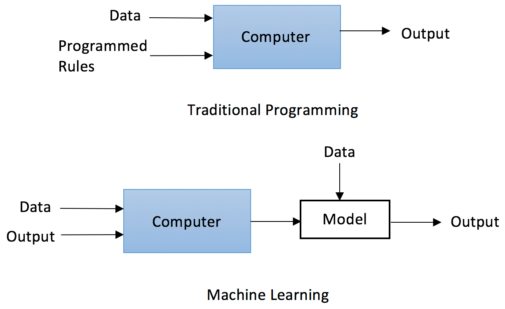
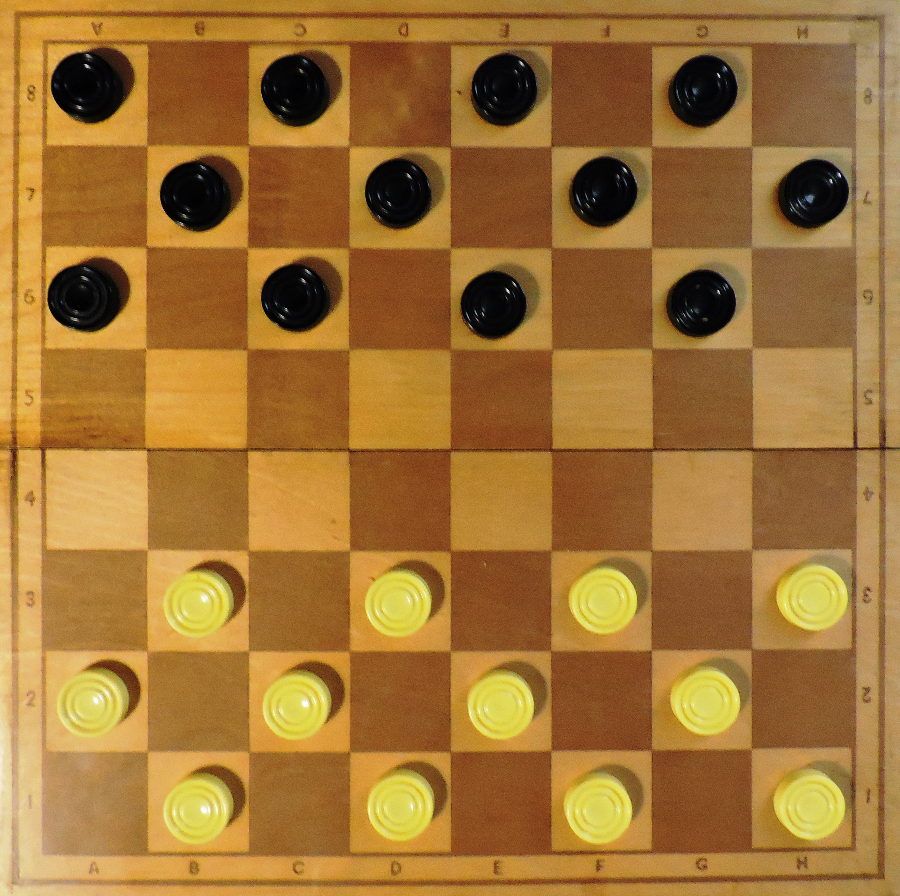
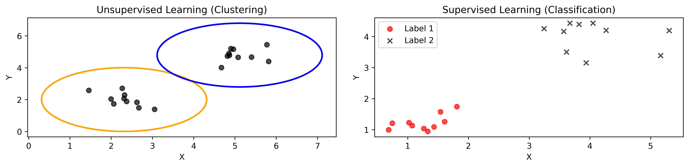

```{r setup, include=FALSE}
knitr::opts_chunk$set(cache = FALSE,
  echo = TRUE,
  warning = FALSE,
  message = FALSE,
  progress = FALSE, 
  verbose = FALSE,
  dev = 'png',
  fig.height = 3,
  dpi = 300,
  fig.align = 'center')

options(htmltools.dir.version = FALSE)


miamired = '#C3142D'

if(require(pacman)==FALSE) install.packages("pacman")
if(require(devtools)==FALSE) install.packages("devtools")
if(require(countdown)==FALSE) devtools::install_github("gadenbuie/countdown")
if(require(xaringanExtra)==FALSE) devtools::install_github("gadenbuie/xaringanExtra")
if(require(urbnmapr)==FALSE) devtools::install_github('UrbanInstitute/urbnmapr')
if(require(emo)==FALSE) devtools::install_github("hadley/emo")

knitr::knit_engines$set(python = reticulate::eng_python)
```

```{r xaringan-themer, include=FALSE, warning=FALSE}
if(require(xaringanthemer) == FALSE) install.packages("xaringanthemer")
library(xaringanthemer)

style_mono_accent(base_color = "#84d6d3",
        base_font_size = "20px")

xaringanExtra::use_xaringan_extra(c("tile_view", "tachyons", "panelset", "search", "fit_screen", "editable", "clipboard"))

xaringanExtra::use_extra_styles(
  hover_code_line = TRUE,
  mute_unhighlighted_code = TRUE
)
```


## Quick Refresher of Last Class

`r emo::ji("check")` Utilize standalone data viz packages to construct and tailor your graphs.  

`r emo::ji("check")` Examine the use of network and/or spatial plots in the context of network data.    


---

## Learning Objectives for Today's Class

- Explain the difference between supervised and unsupervised learning.  

- Understand the importance of different preprocessing steps and when they should be used in ML.  

- Explain typical error measures used for supervised and unsupervised learning tasks.


---

class: inverse, center, middle

# What is Machine Learning?


---

## Definition

- [Mitchell 2006](http://ra.adm.cs.cmu.edu/anon/usr0/ftp/anon/ml/CMU-ML-06-108.pdf) has elegantly defined the scientific field of machine learning to be centered around answering the following question:  

> How can we build computer systems that automatically improve with experience, and what are the fundamental laws that govern all learning processes?

In his view, machine learning is the study of algorithms that:  

- Improve their performance $P$   
- at some task $T$   
- with experience $E$.


---

## A Paradigm Shift in Programming  

```{r paradigm, echo=FALSE, out.width="75%"}

```

.footnote[
<html>
<hr>
</html>

**Image Source:** [Yuxi Lui (2019). Python Machine Learning by Example. Packt
Publishers](https://subscription.packtpub.com/book/data/9781789616729/1).
]


---

## Examples of a Task, Performance, and Experience

.center[**Improve on task $T$, with respect to performance metric $P$, based on experience $E$.**]

.pull-left[

- T: Playing checkers  

- P: Winning percentage against an arbitrary opponent  

- E: Playing practice games against itself  
]

.pull-right[
```{r checkers, echo=FALSE, out.width="50%"}

```
]

Note: This idea in [Samuel (1959)](https://ieeexplore.ieee.org/stamp/stamp.jsp?tp=&arnumber=5392560&tag=1) led to the popularization of machine learning.  


.footnote[
<html>
<hr>
</html>

**Image Source:** [Wikipedia](https://en.wikipedia.org/wiki/Checkers)
]


---

## Examples of a Task, Performance, and Experience

.center[**Improve on task $T$, with respect to performance metric $P$, based on experience $E$.**]

.pull-left[
- T: Recognizing spoken words  

- P: Accuracy of recognizing words  

- E: Listening to a large number of words and their pronunciations  
]

.pull-right[
<html>
<center>
<audio controls autoplay muted>
  <source src="micro-machines.wav" type="audio/wav"/>
</audio>
</center>
</html>


> .font30[This is the Micro Machine Man presenting the most midget miniature motorcade of Micro Machines. Each one has dramatic details, terrific trim, precision paint jobs, plus incredible Micro Machine Pocket Play Sets. There’s a police station, fire station, restaurant, service station, and more. Perfect pocket portables to take any place. And there are many miniature play sets to play with, and each one comes with its own special edition Micro Machine vehicle and fun, fantastic features that miraculously move. Raise the boatlift at the airport marina. Man the gun turret at the army base. Clean your car at the car wash. Raise the toll bridge. And these play sets fit together to form a Micro Machine world. Micro Machine Pocket Play Sets, so tremendously tiny, so perfectly precise, so dazzlingly detailed, you’ll want to pocket them all. Micro Machines are Micro Machine Pocket Play Sets sold separately from Galoob. The smaller they are, the better they are.]

]

.footnote[
<html>
<hr>
</html>

**Audio Source:** [OpenAI](https://openai.com/research/whisper)

]


---

## Examples of a Task, Performance, and Experience

.center[**Improve on task $T$, with respect to performance metric $P$, based on experience $E$.**]

.pull-left[
- T: Classifying emails as spam or not spam  

- P: Accuracy of classifying emails  

- E: Reading a large number of emails and identifying which ones are spam  
] 

.pull-right[
```{r spam, echo=FALSE, out.width="50%"}

knitr::include_graphics("https://miro.medium.com/v2/resize:fit:640/format:webp/1*9vX9GriIxB3yRXYtoEiy8w.jpeg")
```
]

.footnote[
<html>
<hr>
</html>

**Image Source:** [Sarah Mestiri (2017). Applied Text-Classification on Email Spam Filtering - Part 1. Medium.](https://towardsdatascience.com/applied-text-classification-on-email-spam-filtering-part-1-1861e1a83246).
]


---

## History of Machine Learning

```{python history_ml, echo=FALSE, results='hide'}
import matplotlib.pyplot as plt
import matplotlib.dates as mdates
from datetime import datetime
import numpy as np

# Defining the timeline events and dates
events = [
    "Perceptron", "Decision Trees\nHidden Markov Models", "Multilayer Perceptrons", 
    "Backpropagation", "Support Vector Machines", "Long Short-Term Memory (LSTM)", 
    "Convolutional Neural Networks (CNNs)", "Random Forest", "Deep Learning Models", 
    "AlexNet", "VGGNet\nGANs", "Text-to-Image Model\nGAN-INT-CLS", "Transformer Model", 
    "BERT", "GPT-3", "CLIP\nDALL-E", "ChatGPT\nMidJourney\nStable Diffusion"
]
dates = [
    "1957", "1960", "1969", "1980", "1990", "1997", "1998", "2001", "2010", 
    "2012", "2014", "2016", "2017", "2018", "2020", "2021", "2022"
]

# Converting string dates to datetime objects
dates = [datetime.strptime(year, "%Y") for year in dates]

# Initialize figure and axis for the updated visualization
fig, ax = plt.subplots(figsize=(10, 5.25))

# Colors for the bars
colors = plt.cm.tab20c(np.linspace(0, 1, len(events)))

# Height of the bars
height = 0.5

# Plotting each event with updated text placement and year annotation inside the bar
for i, (event, date) in enumerate(zip(events, dates)):
    # Calculate the length of the bar based on the event's year
    bar_length = date.year - (dates[0].year - 1 if i == 0 else dates[i-1].year) + 1
    
    # Plot the bar
    bar = ax.barh(i, bar_length, height, left=(dates[0].year if i == 0 else dates[i-1].year), color=colors[i])
    
    # Annotate with the event text next to the bar
    ax.text(date.year + 2, i, event, va='center', ha='left', fontsize=7)
    
    # Annotate the year inside the bar
    rx, ry = bar[0].get_xy()
    cx = rx + bar[0].get_width() / 2.0

# Hide both axes
ax.axis('off')

plt.tight_layout()

plt.show()

plt.savefig('../../figures/ml_history_timeline_figure.png', dpi=600, bbox_inches='tight')

```

```{r history_ml_out, echo=FALSE, out.width="100%"}
 
```

.footnote[
<html>
<hr>
</html>

**Created By:** Fadel Megahed for ISA 419. **Data Source:** Maryna Klokova (2023). [Evolution of Artificial Intelligence and Machine Learning: A Journey Through Key Milestones](https://medium.com/@marizombie/evolution-of-artificial-intelligence-and-machine-learning-a-visual-journey-through-key-milestones-3b2f63bb2ed7)
]


---

##  Types of Machine Learning

{width=80%}

.footnote[
<html>
<hr>
</html>

**Image Source:** [Scikit-Learn](https://scikit-learn.org/stable/tutorial/machine_learning_map/index.html)
]


---
class: inverse, center, middle

# Explain the Difference Between Unsupervised and Supervised Learning.

---

## Unsupervised Vs. Supervised Learning

| **Aspect**                             | **Unsupervised Learning**                                                                                     | **Supervised Learning**                                                                                          |
|----------------------------------------|---------------------------------------------------------------------------------------------------------------|------------------------------------------------------------------------------------------------------------------|
| **Labels**                            | Labels are **NOT** known                                                                                   | Labels are known                                                                           |
| **Learning Objective**                 | The algorithm tries to **learn the underlying structure** of the data                                | The algorithm tries to **learn the mapping** from input to output                                         |
| **Examples**                          | **Clustering**, **Dimensionality Reduction**                                                |  **Regression**, **Classification**                                                               |
| **Evaluation**                        | Cannot be evaluated easily                                                                        | Can be evaluated using **error measures**                                              |

 

```{python unsupervised_and_supervised, echo=FALSE, results='hide'}
# Correcting the color value error and redefining the plot

# Re-import necessary libraries
import matplotlib.pyplot as plt
import numpy as np

# Recreate simpler datasets for visualization
cluster1 = np.random.randn(10, 2) * 0.5 + np.array([2, 2])
cluster2 = np.random.randn(10, 2) * 0.5 + np.array([5, 5])
group1 = np.random.randn(10, 2) * 0.5 + np.array([1, 1])
group2 = np.random.randn(10, 2) * 0.5 + np.array([4, 4])

# Correct color names
labels_group1 = ['red' for _ in range(10)]
labels_group2 = ['black' for _ in range(10)]

# Create the plot
plt.figure(figsize=(12, 3))

# Unsupervised learning (clustering)
plt.subplot(1, 2, 1)
plt.scatter(cluster1[:, 0], cluster1[:, 1], color='black', marker='o', alpha=0.7, label='Cluster 1')
plt.scatter(cluster2[:, 0], cluster2[:, 1], color='black', marker='o', alpha=0.7, label='Cluster 2')
plt.title('Unsupervised Learning (Clustering)')
plt.xlabel('X')
plt.ylabel('Y')

# Drawing circles around clusters
circle1 = plt.Circle(cluster1.mean(axis=0), 2, color='orange', fill=False, lw=2)
circle2 = plt.Circle(cluster2.mean(axis=0), 2, color='blue', fill=False, lw=2)
plt.gca().add_patch(circle1)
plt.gca().add_patch(circle2)

# Supervised learning (classification)
plt.subplot(1, 2, 2)
plt.scatter(group1[:, 0], group1[:, 1], c=labels_group1, marker='o', alpha=0.7, label='Label 1')
plt.scatter(group2[:, 0], group2[:, 1], c=labels_group2, marker='x', alpha=0.7, label='Label 2')
plt.title('Supervised Learning (Classification)')
plt.xlabel('X')
plt.ylabel('Y')

# Adjusting layout and showing the plot
plt.tight_layout()
plt.legend(loc='best')

# Save the modified figure
plt.savefig('../../figures/unsupervised_supervised.png', dpi=600, bbox_inches='tight')
```

```{r unsupervised_and_supervised_out, echo=FALSE, out.width="60%"}
 
```

---

## Unsupervised Learning

- We retroactively try to understand the structure of the data.  

- We do not have any labels to guide us.  

- So we try to find patterns in the data (and then, we try to make sense of these patterns).  

- Once we make sense of these patterns, we can use them to guide our decision-making process.

- **Cybersecurity** applications include:  
  + **Anomaly Detection**, where we try to find patterns that are different from the norm.   
  + **Clustering**, where we try to group similar entities together (e.g., similar network traffic).  
  + **Dimensionality Reduction**, where we try to reduce the number of features in our data so that we can better understand/visualize/model it.   
  
---

## Supervised Learning

- We have labels to guide us.  

- We build a model that allows us to see:  
  + How the input data is related to the output data.  
  + How we can use this relationship to make predictions.  
  
- **Cybersecurity** applications include:  
  + Classification of network traffic as benign or malicious.  
  + Regression to predict the number of attacks on a network.  
  + Time series forecasting to predict future network traffic (technically not a ML problem, but it can be modeled sometimes using ML-type models).  
  

---

## Class Activity: Build a Fun Model with No Code

`r countdown(minutes = 5, seconds = 0, top = 0, font_size = "2em")`

Go to <https://teachablemachine.withgoogle.com/v1/> and build a simple model to classify images by following the instructions on the page.  

```{r teachable_machine, echo=FALSE, out.width="100%"}
knitr::include_url("https://teachablemachine.withgoogle.com/v1/", height = "400px")
```


---
class: inverse, center, middle

# Preprocessing Steps in Machine Learning

---

## Preprocessing Steps in Machine Learning

- There are several preprocessing steps that are typically used in machine learning. 

- These steps are used to prepare the data for the model.  

- These include:  

| **Step** | **Description** |
|------------------------|-----------------|
| **Z-Transformation ** | Scaling the continuous data so that they have a mean of 0 and a standard deviation of 1. |
| **Data Scaling**| Scaling continuous variables so that they have a min of 0 and a max of 1. |
| **Data Encoding**| Encoding categorical data using label or one-hot encoding. |
| **Data Imputation**| Filling in missing data (apply with caution, only after understanding the type of missingness). |
| **Data Reduction**     | Reducing the number of features in the data. | 

---

## Preprocessing Steps in Machine Learning

- **Z-Transformation**:  
  + This is done to ensure that the data have a mean of 0 and a standard deviation of 1.  
  + This is important for algorithms that are sensitive to the scale of the data (e.g., K-Means clustering).  
  + It is also important for algorithms that use gradient descent (e.g., neural networks).  
  
- **Data Scaling**:  
  + This is done to ensure that the data have a minimum of 0 and a maximum of 1.  
  + This has a similar use case to Z-Transformation.  
  
- **Data Encoding**:  
  + This is done to convert categorical data into a format that can be used by the model.  
  + This is important because most models (e.g., neural networks) cannot handle categorical data.  


---

## Preprocessing Steps in Machine Learning
  
- **Data Imputation**:  
  + This is done to fill in missing data.  
  + This is important because most models cannot handle missing data.  
  + However, this should be done with caution, as it can introduce bias into the model.  

- **Data Reduction**:  
  + This is done to reduce the number of features in the data.  
  + This is important because it can help to reduce the complexity of the model, which can help to reduce overfitting.  
  

---
class: inverse, center, middle

# Error Measures in Machine Learning

---

## Supervised Learning Model Evaluation: Clustering

```{python silhouette_score, echo=FALSE, results='hide'}
import matplotlib.pyplot as plt
import numpy as np
from sklearn.metrics import silhouette_score

# Recreate simpler datasets for visualization
cluster1 = np.random.randn(10, 2) * 0.5 + np.array([2, 2])
cluster2 = np.random.randn(10, 2) * 0.5 + np.array([5, 5])
data_clustering = np.vstack((cluster1, cluster2))
labels = np.concatenate([np.zeros(cluster1.shape[0]), np.ones(cluster2.shape[0])])

# Calculate the silhouette score
silhouette_avg = silhouette_score(data_clustering, labels)

# Create the plot with matched colors and annotations
plt.figure(figsize=(12, 6))

# Unsupervised learning (clustering) plot
plt.subplot(1, 2, 1)
plt.scatter(cluster1[:, 0], cluster1[:, 1], color='black', marker='o', alpha=0.7, label='Cluster 1')
plt.scatter(cluster2[:, 0], cluster2[:, 1], color='black', marker='o', alpha=0.7, label='Cluster 2')
plt.title('Unsupervised Learning (Clustering)')
plt.xlabel('X')
plt.ylabel('Y')

# Drawing circles around clusters
circle1 = plt.Circle(cluster1.mean(axis=0), 2, color='orange', fill=False, lw=2)
circle2 = plt.Circle(cluster2.mean(axis=0), 2, color='blue', fill=False, lw=2)
plt.gca().add_patch(circle1)
plt.gca().add_patch(circle2)

# Annotate silhouette score equation and definitions
plt.text(0.25, 6.5, 'Silhouette Score $s = \\frac{(b - a)}{max(a, b)}$', ha='left', va='center', fontsize=8)
plt.text(0.25, 6, '• $a$: mean intra-cluster distance', ha='left', va='top', fontsize=7)
plt.text(0.25, 5.5, '• $b$: mean nearest-cluster distance', ha='left', va='top', fontsize=7)

# Move the silhouette score annotation to the bottom right of the subplot
plt.text(6, 0.5, f'Silhouette Score: {silhouette_avg:.2f}', ha='right', va='bottom', fontsize=8, color='red')

plt.tight_layout()
plt.show()

plt.savefig('../../figures/silhouette_score_figure.png', dpi=600, bbox_inches='tight')
```


```{r silhouette_score_out, echo=FALSE, fig.align='center'}
 
```

.footnote[
<html>
<hr>
</html>

**Created By:** Fadel M. Megahed for ISA 419.
]

---

## Supervised Learning Model Evaluation: Clustering

- **Silhouette Score**:  
  + This is a measure of how similar an object is to its own cluster (cohesion) compared to other clusters (separation).  
  + The silhouette score ranges from -1 to 1.  
  + A high silhouette score indicates that the object is well matched to its own cluster and poorly matched to neighboring clusters.  


---

## Supervised Learning Model Evaluation: Classification

```{python confusion_matrix, echo=FALSE, results='hide'}
import matplotlib.pyplot as plt
import numpy as np
from sklearn.metrics import confusion_matrix
import seaborn as sns

# Recreate simpler datasets for visualization
y_true = np.array([0, 1, 1, 0, 1, 0, 0, 1, 1, 0])
y_pred = np.array([0, 1, 1, 0, 1, 0, 1, 1, 0, 0])

# Calculate the confusion matrix
cm = confusion_matrix(y_true, y_pred)

# Create the plot
plt.figure(figsize=(5, 5))
sns.heatmap(cm, annot=True, fmt='d', cmap='Blues', cbar=False, 
            xticklabels=['Predicted 0', 'Predicted 1'], 
            yticklabels=['Actual 0', 'Actual 1'])
plt.title('Confusion Matrix')
plt.xlabel('Predicted Label')
plt.ylabel('Actual Label')

# Annotations with specified colors for TN, TP (white) and FN, FP (black)
annotations = [['TN', 'FP'], ['FN', 'TP']]
colors = [['white', 'black'], ['black', 'white']]  # Color assignment: white for TN and TP, black for FN and FP
for i in range(2):
    for j in range(2):
        # Positioning labels 
        plt.text(j + 0.375, i + 0.5, f"{annotations[i][j]} =", ha='right', va='center', color=colors[i][j], fontsize=10)

plt.show()


# Save the modified figure
plt.savefig('../../figures/confusion_matrix_figure.png', dpi=600, bbox_inches='tight')
```

```{r confusion_matrix_out, echo=FALSE, out.width="60%"}
 

```


---

## Supervised Learning Model Evaluation: Classification

- **Accuracy**:  
  + This is the proportion of correctly classified instances (i.e., $\frac{TP + TN}{TP + TN + FP + FN}$)  
  + It is **not** a good measure when the classes are imbalanced or when the cost of misclassification is high.  
  

- **Precision**:  
  + This is the proportion of true positive predictions out of all positive predictions (i.e., $\frac{TP}{TP + FP}$).  
  + It is a good measure when the cost of false positives is high.  
  + It is not a good measure when the cost of false negatives is high.


---

## Supervised Learning Model Evaluation: Classification

- **Recall**:
  + This is the proportion of true positive predictions out of all actual positive instances (i.e., $\frac{TP}{TP + FN}$).  
  + It is a good measure when the cost of false negatives is high.  
  + It is not a good measure when the cost of false positives is high.

- **F1-Score**:  
  + This is the harmonic mean of precision and recall (i.e., $2 \times \frac{precision \times recall}{precision + recall}$).  
  + It is a good measure when the cost of false positives and false negatives is high.  
  + It is a good measure when the classes are imbalanced.  


---

## Supervised Learning Model Evaluation: Classification

- **ROC Curve**:  
  + This is a plot of the true positive rate against the false positive rate (i.e., $\frac{TP}{TP + FN}$ vs. $\frac{FP}{FP + TN}$).  

- **AUROC**:
  + This is the area under the ROC curve.  
  + It is a good measure when the cost of false positives and false negatives is high.  
  + It is a good measure when the classes are imbalanced.


---

## Supervised Learning Model Evaluation: Regression

- **Mean Error (ME)**:  
  + This is the average of the differences between predictions and actual values.  
  + It is a measure of bias.


- **Mean Absolute Error (MAE)**:  
  + This is the average of the absolute differences between predictions and actual values.  
  + It is a good measure when the cost of large errors is high.  
  + It is not a good measure when the cost of small errors is high.  
  
- **Mean Squared Error (MSE)**:  
  + This is the average of the squared differences between predictions and actual values.  
  + It is a good measure when the cost of large errors is high.  
  + It is not a good measure when the cost of small errors is high.
  


---
class: inverse, center, middle

# Recap

---

## Summary of Main Points

By now, you should be able to do the following:  

- Explain the difference between supervised and unsupervised learning.  

- Understand the importance of different preprocessing steps and when they should be used in ML.  

- Explain typical error measures used for supervised and unsupervised learning tasks.  

---

## 📝 Review and Clarification 📝

1. **Class Notes**: Take some time to revisit your class notes for key insights and concepts.
2. **Zoom Recording**: The recording of today's class will be made available on Canvas approximately 3-4 hours after the end of class.
3. **Questions**: Please don't hesitate to ask for clarification on any topics discussed in class. It's crucial not to let questions accumulate. 

