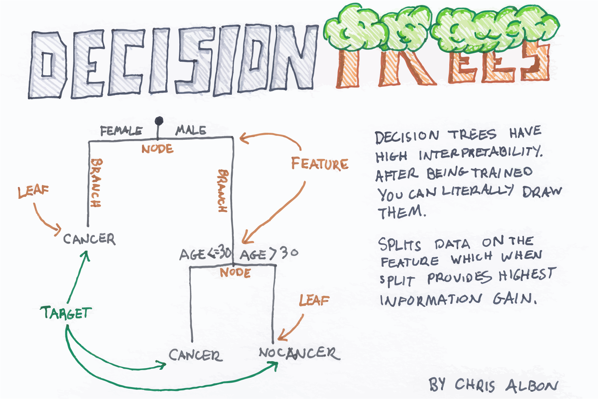

```{r setup, include=FALSE}
knitr::opts_chunk$set(cache = FALSE,
  echo = TRUE,
  warning = FALSE,
  message = FALSE,
  progress = FALSE, 
  verbose = FALSE,
  dev = 'png',
  fig.height = 3,
  dpi = 300,
  fig.align = 'center')

options(htmltools.dir.version = FALSE)


miamired = '#C3142D'

if(require(pacman)==FALSE) install.packages("pacman")
if(require(devtools)==FALSE) install.packages("devtools")
if(require(countdown)==FALSE) devtools::install_github("gadenbuie/countdown")
if(require(xaringanExtra)==FALSE) devtools::install_github("gadenbuie/xaringanExtra")
if(require(urbnmapr)==FALSE) devtools::install_github('UrbanInstitute/urbnmapr')
if(require(emo)==FALSE) devtools::install_github("hadley/emo")

knitr::knit_engines$set(python = reticulate::eng_python)
```

```{r xaringan-themer, include=FALSE, warning=FALSE}
if(require(xaringanthemer) == FALSE) install.packages("xaringanthemer")
library(xaringanthemer)

style_mono_accent(base_color = "#84d6d3",
        base_font_size = "20px")

xaringanExtra::use_xaringan_extra(c("tile_view", "tachyons", "panelset", "search", "fit_screen", "editable", "clipboard"))

xaringanExtra::use_extra_styles(
  hover_code_line = TRUE,
  mute_unhighlighted_code = TRUE
)
```


## Quick Refresher of Last Class

`r emo::ji("check")` Describe the basic concepts of regression analysis, including the roles of independent and dependent variables.  

`r emo::ji("check")` Assess regression models using metrics like R-squared and Mean Squared Error and interpret the results.   

`r emo::ji("check")` Describe the two modeling mindsets: explanatory and predictive.


---

## Learning Objectives for Today's Class

- Recognize the differences and similarities between traditional regression and machine learning regression models  

- Describe advanced techniques like Ridge and Lasso  

- Explore non-linear models like Decision Trees and Random Forests for regression tasks  

- Apply machine learning regression models to cybersecurity datasets


---

class: inverse, center, middle

# Differences Between Traditional (Statistical) and Algorithmic (Machine Learning) Modeling Cultures


---

## Statistical Modeling Culture

Find a stochastic model of the data-generating process in the form of:  $Y = f(X, \, parameters, \, \epsilon)$

```{r stat_model, echo=FALSE, out.width="25%"}

```

.pull-left[
.center[**Assumptions**]

.font90[
- Specific stochastic model of the data-generating process  

- Distributional assumptions about the errors  

- Linearities  

- Manual specification of interactions
]
]

.pull-right[
.center[**Problems**]

.font90[
- Conclusions about model, and not about "nature"  

- Assumptions often violated  

- Often no model evaluation (no focus on prediction)
]
]


.footnote[
<html>
<hr>
</html>

**Image Source**: Chris Molnar. (2014). [Statistical Modeling: The Two Cultures - Based on Leo Breiman's paper](https://www.slideshare.net/christophmolnar/presentation-on-statistical-modeling-the-two-cultures)
]


---

## Algorithmic (Machine Learning) Modeling Culture

Find a function $f(x)$ that minimizes the loss $L(Y, \, f(X))$

```{r alg_model, echo=FALSE, out.width="25%"}
knitr::include_graphics("../../figures/alg_model_culture.png")
```

.pull-left[
.center[**Assumptions**]

.font90[
- No assumptions about the data-generating process (true mechanism of generating the data is **unknown** and not of direct interest).  

- No assumptions about the distribution of the errors.  
]
]

.pull-right[
.center[**Problems**]

.font90[
- Some models are "black boxes".  

- Stability of the model is not guaranteed (and honestly this is also a problem in statistical modeling).
]
]

.footnote[
<html>
<hr>
</html>

**Image Source**: Chris Molnar. (2014). [Statistical Modeling: The Two Cultures - Based on Leo Breiman's paper](https://www.slideshare.net/christophmolnar/presentation-on-statistical-modeling-the-two-cultures)
]


---

## Statistical Modeling: The Two Cultures

```{r breiman, echo=FALSE, out.width="40%"}

```

.footnote[
<html>
<hr>
</html>

**Note**: You are highly encouraged to read Leo Breiman's paper on the two cultures of statistical modeling. It's a classic and a must-read for anyone interested in data science and machine learning. See [Breiman 2001](https://www.jstor.org/stable/2676681).
]


---
class: inverse, center, middle

# Advanced Techniques for Regression

---

## Ridge Regression

```{r ridge, echo=FALSE, out.width="72%"}

```

.footnote[
<html>
<hr>
</html>

**Image Source:** Chris Albon. (2017). [Machine Learning Flashcards](https://machinelearningflashcards.com/). Flashcards were purchased by the author and are not available for free.
]


---

## Lasso Regression

```{r lasso, echo=FALSE, out.width="72%"}


```

.footnote[
<html>
<hr>
</html>

**Image Source:** Chris Albon. (2017). [Machine Learning Flashcards](https://machinelearningflashcards.com/). Flashcards were purchased by the author and are not available for free.
]


---
class: inverse, center, middle

# Non-Linear Models for Regression


---

## Decision Trees (Classification and Regression Trees)

```{r dt1, echo=FALSE, out.width="72%"}

```

.footnote[
<html>
<hr>
</html>

**Image Source:** Chris Albon. (2017). [Machine Learning Flashcards](https://machinelearningflashcards.com/). Flashcards were purchased by the author and are not available for free.
]


---

## Decision Trees (Classification and Regression Trees)

```{r dt2, echo=FALSE, out.width="72%"}

```

.footnote[
<html>
<hr>
</html>

**Image Source:** Chris Albon. (2017). [Machine Learning Flashcards](https://machinelearningflashcards.com/). Flashcards were purchased by the author and are not available for free.
]


---

## Random Forests

```{r rf1, echo=FALSE, out.width="72%"}
knitr::include_graphics("https://miro.medium.com/v2/resize:fit:4800/format:webp/1*ZFuMI_HrI3jt2Wlay73IUQ.png")

```

.footnote[
<html>
<hr>
</html>

**Image Source:** Chaya. (2020). [Random Forest Regression](https://levelup.gitconnected.com/random-forest-regression-209c0f354c84).
]


---

## Random Forests

```{r rf2, echo=FALSE, out.width="72%"}

```

.footnote[
<html>
<hr>
</html>

**Image Source:** Chris Albon. (2017). [Machine Learning Flashcards](https://machinelearningflashcards.com/). Flashcards were purchased by the author and are not available for free.
]


---
class: inverse, center, middle

# Applications to Cybersecurity Datasets

---

## Example: Predicting Flow Duration in IoT Networks

```{python, eval=FALSE}
from ucimlrepo import fetch_ucirepo 
  
# fetch dataset 
rt_iot2022 = fetch_ucirepo(id=942) 
  
# data (as pandas dataframes) 
X = rt_iot2022.data.features 
y = rt_iot2022.data.targets
df = pd.concat([X, y], axis=1)

# subset the features and dataset
df = (
  df
  .sample(frac=0.1, random_state=2024)
  .reset_index(drop=True)
  .loc[:, ['proto', 'service', 'fwd_pkts_payload.avg', 'bwd_pkts_payload.avg', 'fwd_subflow_pkts', 'bwd_subflow_pkts', 'Attack_type', "flow_duration"]]
  )
```

.footnote[
<html>
<hr>
</html>

**Note**: The dataset is from the UCI Machine Learning Repository. It contains features of network traffic in IoT networks and the target variable is the flow duration. The goal is to predict the flow duration using the features. For more information, see [UCI RT-IoT2022](https://archive.ics.uci.edu/dataset/942/rt-iot2022).
]


---
class: inverse, center, middle

# Recap

---

## Summary of Main Points

By now, you should be able to do the following:  

- Recognize the differences and similarities between traditional regression and machine learning regression models  

- Describe advanced techniques like Ridge and Lasso  

- Explore non-linear models like Decision Trees and Random Forests for regression tasks  

- Apply machine learning regression models to cybersecurity datasets

---

## 📝 Review and Clarification 📝

1. **Class Notes**: Take some time to revisit your class notes for key insights and concepts.
2. **Zoom Recording**: The recording of today's class will be made available on Canvas approximately 3-4 hours after the end of class.
3. **Questions**: Please don't hesitate to ask for clarification on any topics discussed in class. It's crucial not to let questions accumulate. 

