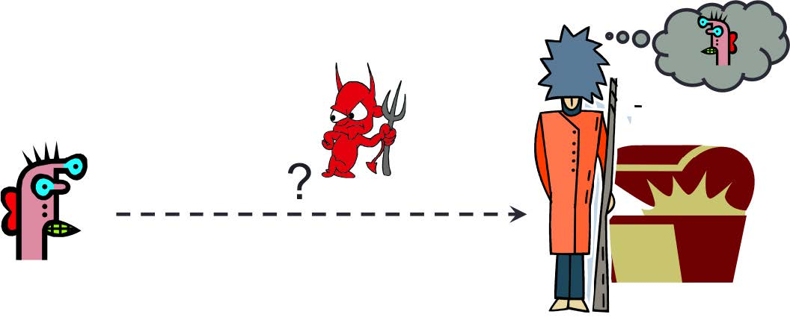
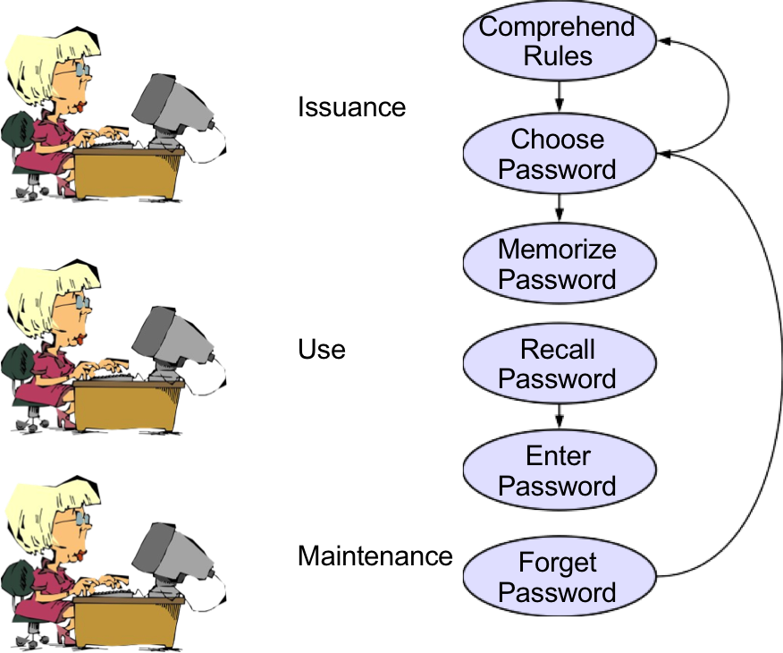
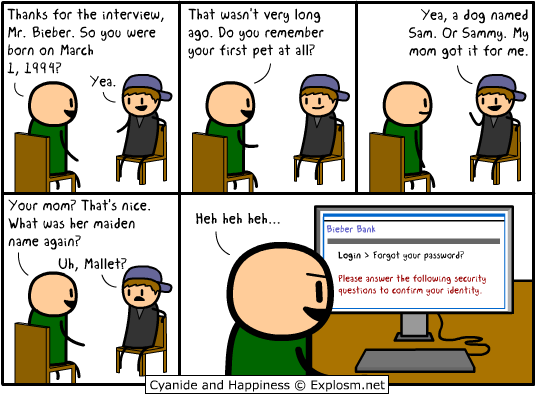
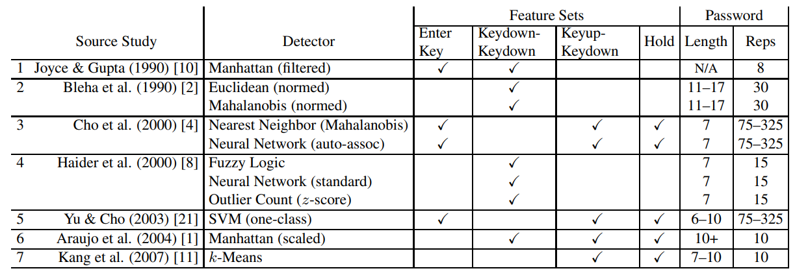
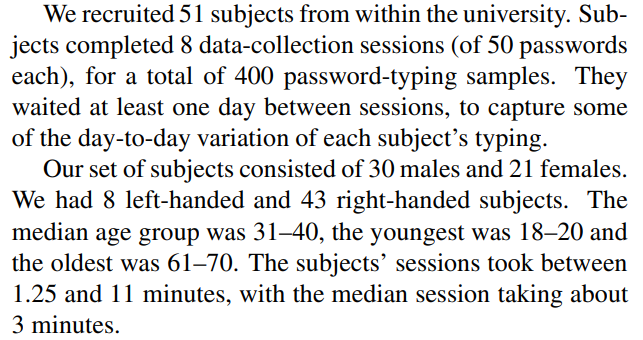

```{r setup, include=FALSE}
knitr::opts_chunk$set(cache = FALSE,
  echo = TRUE,
  warning = FALSE,
  message = FALSE,
  progress = FALSE, 
  verbose = FALSE,
  dev = 'png',
  fig.height = 3,
  dpi = 300,
  fig.align = 'center')

options(htmltools.dir.version = FALSE)


miamired = '#C3142D'

if(require(pacman)==FALSE) install.packages("pacman")
if(require(devtools)==FALSE) install.packages("devtools")
if(require(countdown)==FALSE) devtools::install_github("gadenbuie/countdown")
if(require(xaringanExtra)==FALSE) devtools::install_github("gadenbuie/xaringanExtra")
if(require(urbnmapr)==FALSE) devtools::install_github('UrbanInstitute/urbnmapr')
if(require(emo)==FALSE) devtools::install_github("hadley/emo")

knitr::knit_engines$set(python = reticulate::eng_python)
```

```{r xaringan-themer, include=FALSE, warning=FALSE}
if(require(xaringanthemer) == FALSE) install.packages("xaringanthemer")
library(xaringanthemer)

style_mono_accent(base_color = "#84d6d3",
        base_font_size = "20px")

xaringanExtra::use_xaringan_extra(c("tile_view", "tachyons", "panelset", "search", "fit_screen", "editable", "clipboard"))

xaringanExtra::use_extra_styles(
  hover_code_line = TRUE,
  mute_unhighlighted_code = TRUE
)
```


## Learning Objectives for Today's Class

- Motivating the use of behavioral biometrics for authentication purposes  

- Explain possible sources of data and application for behavioral biometrics  

- Model behavioral biometrics data using machine learning techniques


---

class: inverse, center, middle

# Motivating the Use of Behavioral Biometrics for Authentication Purposes


---

## Authentication

- **Authentication** is the process of verifying the identity of a user or system.  

```{r authentication, out.width = "80%", fig.align='center', echo=FALSE}

```

.center[.bold[How do you prove to someone that you are who you claim to be?]]

---

## Information Traditionally Used for Authentication

.bold[.center[User authentication is the most common and best studied human security
task.]]

**Something you know** Passwords, PINs, security questions  

**Something you have:** Smart cards, tokens, mobile phones  

**Something you are:** Biometrics (fingerprint, face, iris, etc.)


---

## Lifecycle for Authentication Information

**Issuance:** User enrolls in the system and provides authentication information

**Usage:** User logs in and provides authentication information  

**Maintenance/Revocation:** User's authentication information is revised or retired


---

## Lifecycle: Something You Know

.font90[
**Issuance:**  
  - User "has" to memorize a new password or (unfortunately) reuse an existing one.  
  - Should follow password guidelines (length, complexity, uniqueness)  
  - Needs to be sufficiently secure and memorable
  
**Usage:**
  - Can I remember my password?  
  - If so, which one is it (out of the many I have or the updates I have made)?  

**Maintenance:**  
  - Subject to loss/expiration   
  - Re-issuance may require secondary mechanism    
  - Rules on freshness/variation for re-issued data  

]  

---

## Lifecycle: Something You Have

**Issuance:**  
  - User "has" to carry a new token or smart card.  
  - Should be kept secure and not shared with others.  
  - Needs to be sufficiently secure and portable.
  
**Usage:**  
  - Requirements on human memory: Where did I leave my card? Which card is it?  
  - Requirements on physical presence: Do I have it with me?  
  
**Maintenance:**
  - Subject to loss/theft   
  - Requires periodic replacements


---

## Lifecycle: Something You Are

**Issuance:**  
  - “Reverse issuance” required to submit biometrics  
  - Accessibility: not all humans have readable fingerprints, irises, etc.  
  
**Usage:**  
  - Minimal requirements placed upon human memory, e.g., “Which finger did I use?”, though may be specified at authentication  
  - Human-machine interface issues, e.g., what to do with a cut finger?
  
**Maintenance:**  
  - May possibly change with aging, injury, etc.  
  - In general, there are limited options for renewal due to finite set of biometrics. 
  
  
---

## Lifecycle: General Guidelines 

- **Issuance:**  
  - Limit amount of physical interaction  
  - Limit human processing and learning requirements  
  - Limit number of seemingly artificial constraints

- **Usage:**
  - Limit human memory requirements  
  - Limit requirements for perfect accuracy  

- **Maintenance:**
  - See Issuance guidelines  
  - Limit excessive update requirements
  

---

## Password Lifecycle

```{r passlc, out.width = "55%", fig.align='center', echo=FALSE}

```

---

## The "Traditional" Approach to Replacing Passwords `r fontawesome::fa("circle-xmark", fill = miamired)`

```{r challenge1, echo=FALSE, out.width = "65%", fig.align='center'}

```

---

## The "Traditional" Approach to Replacing Passwords `r fontawesome::fa("circle-xmark", fill = miamired)`

```{r challenge2, echo=FALSE, out.width = "100%", fig.align='center'}


```


---
class: inverse, center, middle

# Behavioral Biometrics for Authentication

---

## The Keystroke Dynamics - Benchmark Data Set 

Based on [Killourhy and Maxion (2009)](https://www.cs.cmu.edu/~keystroke/), the authors set up their experiment as follows:  

  - **Password:** .tie5Roanl  
  - **Feature sets:** 
    + The **Enter** key was considered to be a part of their password  
    + **Keydown-Keydown:** time between the key presses of consecutive keys is used as a feature;  
    + **Keyup-Keydown:** time between the release of one key and the press of the next is used;  
    + **Hold:** time between the press and release of each key is used  
  - Note that their features are linearly dependent; for example, $Keydown.Keydown = Hold + Keyup − Keydown$.  
  - Additionally, their features are all recorded in seconds.


---

## Choice of Features

```{r chocie1, out.width = "100%", fig.align='center', echo=FALSE}

```


---

## Subject $\times$ Sessions

```{r chocie2, out.width = "75%", fig.align='center', echo=FALSE}


```


---

## Non-Graded Class Activity

`r countdown(minutes = 10, seconds = 0, top = 0, font_size = "2em")`

- Use the following [link](https://www.cs.cmu.edu/~keystroke/) to access the data set.  

- Download the data set and explore the features.  

- In plain English, define three different approaches for modeling this dataset and write them below. 

.font80[
.can-edit.key-activity15[
- Edit me to answer the question above.  

- Edit me to answer the question above.  

- Edit me to answer the question above.
]
]


---

## In-Class Demo

```{python, include = F, eval = F}
import pandas as pd
from pycaret.classification import *

df = pd.read_csv("https://www.cs.cmu.edu/~keystroke/DSL-StrongPasswordData.csv")

sub2 = df[df['subject'] == 's002']
sub2 = sub2.drop(columns = ['sessionIndex', 'rep'])

# sample 400 rows from the other subjects
other_subjects = df[df['subject'] != 's002']
other_subjects = other_subjects.drop(columns = ['sessionIndex', 'rep'])

sub2 = sub2.append( other_subjects.sample(400, random_state = 2024) )

sub2['target'] = sub2['subject'].apply(lambda x: 1 if x == 's002' else 0)

setup(
  data = sub2, target = 'target', session_id = 2024, 
  train_size = 0.8, ignore_features = ['subject']
  )

best = compare_models()

```


---
class: inverse, center, middle

# Recap

---

## Summary of Main Points

By now, you should be able to do the following:  

- Motivating the use of behavioral biometrics for authentication purposes  

- Explain possible sources of data and application for behavioral biometrics  

- Model behavioral biometrics data using machine learning techniques

---

## 📝 Review and Clarification 📝

1. **Class Notes**: Take some time to revisit your class notes for key insights and concepts.
2. **Zoom Recording**: The recording of today's class will be made available on Canvas approximately 3-4 hours after the end of class.
3. **Questions**: Please don't hesitate to ask for clarification on any topics discussed in class. It's crucial not to let questions accumulate. 

