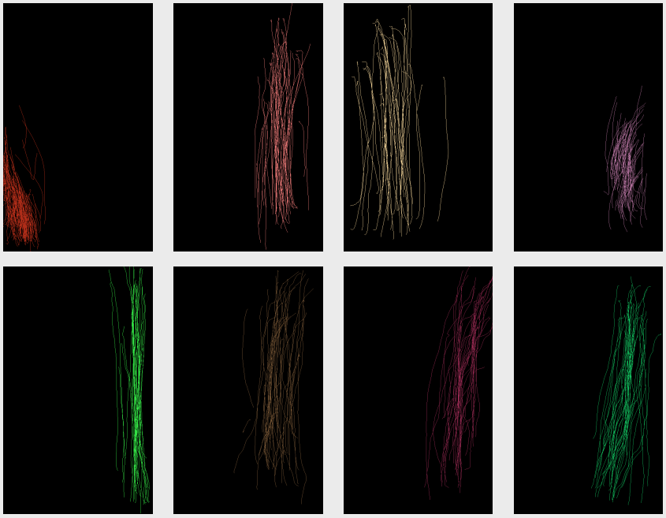

```{r setup, include=FALSE}
knitr::opts_chunk$set(cache = FALSE,
  echo = TRUE,
  warning = FALSE,
  message = FALSE,
  progress = FALSE, 
  verbose = FALSE,
  dev = 'png',
  fig.height = 3,
  dpi = 300,
  fig.align = 'center')

options(htmltools.dir.version = FALSE)


miamired = '#C3142D'

if(require(pacman)==FALSE) install.packages("pacman")
if(require(devtools)==FALSE) install.packages("devtools")
if(require(countdown)==FALSE) devtools::install_github("gadenbuie/countdown")
if(require(xaringanExtra)==FALSE) devtools::install_github("gadenbuie/xaringanExtra")
if(require(urbnmapr)==FALSE) devtools::install_github('UrbanInstitute/urbnmapr')
if(require(emo)==FALSE) devtools::install_github("hadley/emo")

knitr::knit_engines$set(python = reticulate::eng_python)
```

```{r xaringan-themer, include=FALSE, warning=FALSE}
if(require(xaringanthemer) == FALSE) install.packages("xaringanthemer")
library(xaringanthemer)

style_mono_accent(base_color = "#84d6d3",
        base_font_size = "20px")

xaringanExtra::use_xaringan_extra(c("tile_view", "tachyons", "panelset", "search", "fit_screen", "editable", "clipboard"))

xaringanExtra::use_extra_styles(
  hover_code_line = TRUE,
  mute_unhighlighted_code = TRUE
)
```


## Learning Objectives for Today's Class

- Examine an Android Phone's behavioral touch feature dataset   

- Replicate the analysis performed by a InfoSec research paper  

- Report the code and results in an understandable manner to a general audience


---

class: inverse, center, middle

# An Overview of the Touchalytics Paper


---

## The Touchalytics Paper

[This paper](http://www.mariofrank.net/paper/touchalytics.pdf) is one of the seminal papers, where smart phone touch features are engineered and used for continuous authentication. The paper has over 1,000 citations, and provides a [website](http://www.mariofrank.net/touchalytics/) that contains:  

  - [The raw data](http://www.mariofrank.net/touchalytics/data.zip) (do not forget to examine the [readme file](http://www.mariofrank.net/touchalytics/readme_data.txt))  
  - [The extracted features](http://www.mariofrank.net/touchalytics/features.zip) (see the [readme](http://www.mariofrank.net/touchalytics/readme_features.txt))    
  - [Matlab Script File](http://www.mariofrank.net/touchalytics/extractFeatures.m) for how the features were engineered from the raw data file  
  - PDFs of their published work; for our lab, we are interested in the [Touchalytics Paper](http://www.mariofrank.net/paper/touchalytics.pdf)


---

## Paper's Motivation [1]

- There is limited work on continuous authentication for touchscreen devices   

- Use of smart phone devices typically involves "atomic navigation behavior", which consists of simple and short movements  

- Is it possible to authenticate users while they perform basic navigation steps on a touchscreen device and without any dedicated and explicit security action that requires attention from the user?


---

## Paper's Motivation [2]

```{r echo=FALSE, out.width = "55%", fig.alt="Strokes from eight different users, each reading three different texts on an Android Phone", fig.cap="Strokes from eight different users, each reading three different texts on an Android Phone"}

```


---

## Paper's General Idea

There are two phases for learning and classifying touch behavior.    

- **Enrollment Phase:** Phase where the system relies on a conventional authentication approach (e.g., password). The authors distinguish between two different "trigger-actions":        
    - Sliding horizontally over the screen; for example, to browse through images   
    - Sliding vertically over the screen to move conten up and down   
    - Note that the authors decided to use only on on **single touch gestures**    
    
-  **Continuous Authentication Phase:** During this phase, the system continuously tracks all strokes and the classifier estimates if they were made by the legitimate user. For *t* consecutive negative classification results, the system resorts back to the initial entry-point based authentication method and challenges the user. 


---

## Paper's Goals

**The main goal of their study is to analyze how robustly our proposed framework can distinguish users from each other.**

- What is the probability of rejecting a legitimate user?   

- What is the probability of accepting an attacker?   

- How long does the classifier need to make an authentication decision?  

- How robust is the classification within one session, across multiple sessions, and after one week?


---

## Experimental Protocol

- Sessions 1-3 occurred during the same day and separated by a questionnaire.  This is followed by a second phase, where users were asked to spot differences between images.   

- Sessions 6-7 occurred one week post the sessions in the previous bullet.  


---

## Touch Analytics [1]

```{r, echo=FALSE, out.width = "100%", fig.alt="Stroke features projected on a 2D-subspace. The user ID is given as a colored number", fig.cap="Stroke features projected on a 2D-subspace. The user ID is given as a colored number"}

```

---

## Touch Analytics [2]

```{r, echo=FALSE, out.width = "90%", fig.alt="Correlation among the 30 features", fig.cap="Correlation among the 30 features"}

```


---

## Classification Schemes: kNN

**The kNN (k-Nearest Neighbors) algorithm has the following features:**     
  - Supervised learning algorithm    
  - Utilizes feature similarity   
  - Lazy algorithm since it uses the entire training data to make a decision instead of coming up with a discrminative function  

The following kNN Slides are based on the [edureka.co Blog](https://www.edureka.co/blog/knn-algorithm-in-r/). 


---

## Classification Schemes: kNN

```{r echo=FALSE, out.width = "100%"}

```

---

## Classification Schemes: kNN

```{r echo=FALSE, out.width = "100%"}

```


---

## Classification Schemes: kNN

```{r echo=FALSE, out.width = "100%"}

```


---

## Classification Schemes: kNN

```{r echo=FALSE, out.width = "100%"}

```


---

## Classification Schemes: kNN

```{r echo=FALSE, out.width = "72%", fig.align='center'}

```


---

## Classification Schemes: kNN

```{r echo=FALSE, out.width = "100%"}

```


---

## Classification Schemes: kNN

**Pseudo Code**

- Calculate $D(x, x_i)$, where $i =1, 2, ..., n$ and $D$ is the Euclidean measure between the data points. 

- The calculated Euclidean distances must be arranged in ascending order.  

- Initialize $k$ and take the first $k$ distances from the sorted list.  

- Figure out the $k$ points for the respective $k$ distances.  

- Calculate $k_i$, which indicates the number of data points belonging to the $i$th class among $k$ points i.e. $k \ge 0$.  

- If $k_i > k_j \forall i \ne j$; put $x$ in class $i$.

*Note that in the paper, they have used $k \in [1, 3, 5, 7]$ to avoid ties.*


---

## Classification Schemes: SVM

**In this paper, they used it for binary classification. The used a RBF for the kernel, which means that they assumed that the data is not linearly seperable.**

The following SVM Slides are based on the [edureka.co Blog](https://www.edureka.co/blog/support-vector-machine-in-python/).


---

## Classification Schemes: SVM

```{r echo=FALSE, out.width = "70%"}

```


---

## Classification Schemes: SVM

```{r echo=FALSE, out.width = "70%"}
knitr::include_graphics("../../figures/svm-2.png")
```


---
class: inverse, center, middle

# Lab Instructions

---

## Lab Instructions

For the purposes of Lab 04, I would like you to replicate the analysis performed by @frank2012touchalytics. You can start with the [The extracted features](http://www.mariofrank.net/touchalytics/features.zip) and simplify the problem into a binary classification problem, where you will need to recode the data at least 40 times such that for a given user we compare him/her to everyone else. 

```{r echo=FALSE, out.width = '90%'}

```

---

## Lab Instructions

**Rubric:** 

- A student will score 80% on the assignment if they can successfully use both kNN and SVM to distinguish one user of their choice from the rest of the group based on the **inter-week** sessions.  

- A student will score 100% on the assignment if they can successfully use both kNN and SVM to distinguish one user of their choice from the rest of the group based on two different training approaches: (a) intra-session, (b) inter-session, and/or (c) inter-week sessions.

- A student will score 120% on the assignment if they can successfully use both kNN and SVM to distinguish all users from the rest of the group based on all three different training approaches: (a) intra-session, (b) inter-session, and (c) inter-week sessions.

You can work individually or in a group of two. Your submission should include: (a) your Notebook, and (b) a CSV file with results from your code.


---
class: inverse, center, middle

# Recap

---

## Summary of Main Points

By now, you should be able to do the following:  

- Examine an Android Phone's behavioral touch feature dataset   

- Replicate the analysis performed by a InfoSec research paper  

- Report the code and results in an understandable manner to a general audience

---

## 📝 Review and Clarification 📝

1. **Class Notes**: Take some time to revisit your class notes for key insights and concepts.
2. **Zoom Recording**: The recording of today's class will be made available on Canvas approximately 3-4 hours after the end of class.
3. **Questions**: Please don't hesitate to ask for clarification on any topics discussed in class. It's crucial not to let questions accumulate. 

